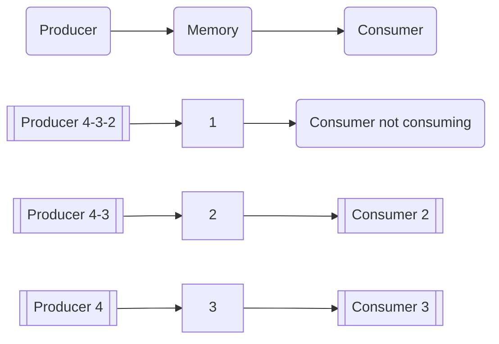
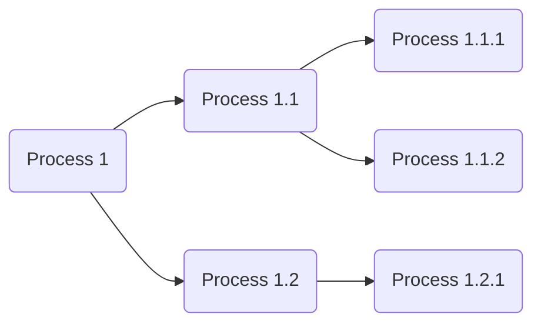

---
title: UD01: Multiprocesses coding
language: EN
author: David Martínez Peña [www.martinezpenya.es]
subject: Services and Processes coding
keywords: [PSP, 2022, coding, services, processes, multithread, Java]
IES: IES Eduardo Primo Marqués (Carlet) [www.ieseduardoprimo.es]
header: ${title} - ${subject} (ver. ${today}) 
footer:${currentFileName}.pdf - ${author} - ${IES} - ${pageNo}/${pageCount}
typora-root-url:${filename}/../
typora-copy-images-to:${filename}/../assets
imgcover:/media/DADES/NextCloud/DOCENCIA/PSP_2223/PSP-CFGS-2223/UD01/assets/cover.png
---
[toc]

# Multiprocess systems

Nowadays computers perform many tasks at the same time, but that has not always been the case. In the beginning, computers were programmed/wired to perform a specific task, and when another task had to be performed, the programming/wiring had to be done again. Generally this task was associated with women.

Later in time, with the appearance of the next generation of computers, these were capable of performing different tasks, but not at the same time (batch processes).

In the next step we had computers that simulated performing more than one task at the same time, although they really only had one processor.

Only when we get to the modern generation of computers and operating systems (with more than one core or processor) is it possible to actually perform more than one task simultaneously.

Another vision is committed to using several computers and building a network in which the components carry out the work in a distributed manner.

There are many terms, possibilities, difficulties and their corresponding solutions around multiprocesses systems and programming. In this unit we will learn the foundations that support multiprocesses programming to understand and apply the techniques in our software solutions.

A current computer is capable of playing a sound file, printing a document, downloading a program from the Internet, receiving an email, updating the operating system and monitoring the temperature of the CPU. But this should make us wonder: how can you do more than the number of cores or processors in your system?

**Multitasking** is the ability of computers to perform several tasks at the same time, regardless of the number of cores or processors. Also you can be:

- **Real**: if the system has as many cores or processors as tasks to be executed simultaneously.
- **Simulated**: the number of cores or processors is less than the number of tasks to execute at the same time.

> **Who does the ability to multitask depend on?**
>
> There are two components involved, the physical part (hardware) through the processor. And the logical part (software) is the operating system. Both are necessary in equal measure.


## The processor

One of the most important elements of a computer system (computer, mobile, console, car, etc.) is the **processor**. This element provides the ability to execute program instructions. It is like the brain of the system.

A **core** is an execution-capable unit within a processor. In a system with one processor and four cores, four instructions can be executed simultaneously. This does not mean that you have four processors, but it does mean that you have much more simultaneous processing capacity.


> **Does all this mean that a single core processor cannot multitask?**
>
> The answer is NO. Any system can run multiple tasks and appear to do them all simultaneously. You should allocate a small portion of execution time to each task, so that switching between them (called context switching) is not noticeable. This will give the illusion that the tasks are running simultaneously.

## Operating System and programming languages

In addition to the hardware, the computer system needs to have an operating system and programs. Both parts are necessary for the system to perform its function. One without the other is meaningless.

The operating system acts as an intermediary between the user and the computer hardware through its software. If the user presses a key or moves the mouse, the operating system detects the event and makes it possible to handle it. When a program needs to access a memory or storage area, the operating system is in charge of moving the heads or activating the corresponding memory chip.

> **Can you program something that you don't really know how it works?**
>
> In most cases the answer is yes, that is precisely the job of the operating system, it does not offer the possibility of generating a new file without going into detail about how it reserves the sectors on the disk, how it moves the motors or the head to get it.

Programming languages ​​have different ways of being categorized:

- **Compiled**: They are those that generate a resulting code that will later be executed. This can be done by creating an executable file with the machine code, prepared for direct execution by the physical machine. But some current languages ​​also allow their source code to be compiled, resulting in an intermediate code, stored in a file. This file is subsequently interpreted and executed directly step by step (converted step by step to machine code). Programs compiled to native code at compile time are usually faster than those translated at run time. They generate the problem that the machine code created is dependent on the architecture of the platform on which they are compiled and for which they are executed. Examples: C, C++, Visual Basic, Fortran, Pascal


  ```mermaid
  graph LR
  A(Application) --> B(Machine)
  ```

- **Interpreted:** These are languages ​​whose instructions are translated to be **executed by the hardware machine at the moment of execution**, without creating any intermediate code, or saving the result of said translation. They are slower than compiled languages ​​because of the need to translate the program into machine code, instruction by instruction, as it executes. Due to this execution in real time, the entire set of instructions is not translated, but it is translated as each one of them is executed. They allow the interpreted program to be offered an environment **not** dependent on the machine where the interpreter is executed, but on the interpreter itself. Examples: Html, Php, Python, Ruby, Javascript.


  ```mermaid
  graph LR
  A(Application) --> C(Interpreter) --> B(Machine)
  ```

  ### Intermediate Language

  We know under this concept the product of the compilation of some high-level languages ​​into a type of language ([bytecode](https://en.wikipedia.org/wiki/Bytecode)). To improve the optimization process or facilitate *portability*, some implementations of programming languages ​​can compile the original source code in an intermediate form and then translate (interpret) that into machine code via a ([virtual machine](https:/ /en.wikipedia.org/wiki/Virtual_machine)). This happens with languages ​​like Java or C#.

## Programs, executables, processes and services

It is necessary to understand the small differences between the terms: **Program**, **process**, **executable** and **service**, which refer to different elements, but closely related.

In order to be able to execute a program, you must first have it available or create it to be able to execute it. If the programmer writes the code that generates the program that will later be executed by the user, the following steps will be followed:

1. The programmer writes the source code with a text editor or **IDE** and stores it in a file.

2. The programmer compiles the source code using a **compiler**, generating an **executable** **program**. This program contains instructions understandable by the operating system for which the compilation was made.
3. The user runs the executable program, spawning a **process**.

Therefore, a program, when executed by a user, spawns a process in the operating system: **a process is a running program**.

A **service** is also a program but its execution is done in the **background** and **does not require user interaction**. Normally, it is started automatically by the operating system and is constantly running.

In linux we can see the processes with the command `top` or `htop`:


And on Windows with Task Manager:


It is interesting to note that in **interpreted** or **intermediate** programs, the process that is started is not the program itself, but the interpreter (as in `Python`) or the virtual machine (as in `Java`). **In these cases the name of the process does not match the name of the program**.

> Notice how in both screenshots the number of running processes is much higher than the number of processors/cores available in the system.

## Parallel and concurrent computing

Virtually all modern operating systems are **multitasking** or **multithreaded**.

A system that has a single core processor is capable of multitasking through concurrency. Processor times are distributed by the process scheduler of the Operating System. If the system is fast enough and the scheduler performs its work correctly, the appearance for the user is that everything is doing at the same time, although this is not the case.

Multi-processor or multi-core systems allow multiple instructions to be executed in a single clock cycle (at the same time). This allows multiple instructions to be executed in parallel, which is known as **parallel processing**. Processes are divided into small threads (threads) that run on different cores or processors, getting the same work done faster.

In summary:


- **Concurrent processing**. It is the one in which several processes are executed in the same processor/core alternately, achieving their simultaneous progress.

  > Talking and chewing gum is concurrence

- **Parallel processing**. It is the one in which the threads (threads) of a process are executed simultaneously in the various processors/cores.

  > Walking and eating gum is parallelism

In conclusion, concurrent processing is the responsibility of the operating system while parallel processing is the responsibility shared between the operating system and the program (Programmer).

## Distributed programming

Another multithreaded paradigm is distributed programming, where the execution of the software is distributed among several computers, in order to have a much higher, scalable and economical processing power. If in a computing system the available cores/processes are fixed and cannot be changed easily, in a distributed system this limitation disappears.

To have a distributed system we need a **network of computers**. Not all tasks can be distributed, nor in all cases will a benefit be obtained compared to a conventional execution, but if this advantage can be taken advantage of, the system will be much more efficient and will require a lower investment than obtaining a single system with the same power.

> No matter how many elephants you gestate, her pregnancy will last 22 months

**Distributed processing is where a process runs on separate cores/processors connected and synchronized over a network.**


## Threads

A basic program is made up of a series of statements that are executed sequentially and synchronously: until the execution of the first of the statements is completed, the execution of the second is not started, and so on until the execution of the second is finished. Full program.

In many cases, this sequentiality and synchrony is necessary, since the different steps of the programmed algorithm are dependent on each other and there is no possibility of reversing the order of execution without generating an erroneous process result. In other cases, however, an algorithm could be broken into several smaller units, run each one separately and in parallel, put the results together regardless of the order in which they are obtained, and generate the final result. This technique is known as **multithread programming**.

**Threads** are program fractions that, if they meet certain characteristics, can be executed simultaneously thanks to parallel processing.

Being part of the same process, they are extremely economical in reference to the resources they use.

Programs that run in a single thread are called **single-threaded** programs, while those that run in multiple threads are called **multi-threaded** programs.

## `Fork`


A fork is an identical copy of a process. The original process is called **parent** and its copies, **children**, all of them having different process identifiers (PID). The created copy continues with the state of the original (parent) process, but from creation each process maintains its own memory state.

>In `Java` there is the Fork/Join framework since version 7. It provides tools to take advantage of the operating system kernels and perform parallel processing.

See [Example01](##Example01)

## Concurrent programming problems


When creating a concurrent program we can find several problems:

### Critical Sections

Critical sections are one of the most common problems in concurrent programming. We have multiple processes running concurrently and each of them has a piece of code that needs to run exclusively as it accesses shared resources like files, common variables, database records, etc.

The solution will be to force access to the resources through the execution of a code that we will call **critical section** and that will allow us to protect those resources with mechanisms that prevent the simultaneous execution of two or more processes within the limits of the critical section.

These synchronization algorithms that prevent access to a critical region by more than one thread or process and that guarantee that only one process will be using this resource and the rest that want to use it will be waiting for it to be released, it is called **mutual exclusion algorithm**.

> Mutual exclusion (**MUTEX**, mutual exclusion in English) is the type of synchronization that prevents two processes from executing the same critical section simultaneously.

A synchronization mechanism in the form of code that protects the critical section should have a form like the following:

```java
Enter_MUTEX // request to execute critical section
/* Critical section code */
Exit_MUTEX // another process can run the critical section
```

`Enter_MUTEX` represents the part of the code where processes ask permission to enter the critical section. The `Exit_MUTEX` instead represents the part that processes execute when they exit the critical section by freeing the section and allowing other processes to enter it.

To validate any critical section synchronization mechanism, the following criteria must be met:

- **Mutual exclusion:** there cannot be more than one process simultaneously in the critical section.
- **No starvation (inanicion):** a process cannot wait an indefinite time to enter to execute the critical section.
- **No deadlock (interbloqueo):** no process outside the critical section can prevent another process from entering the critical section.
- **Hardware Independence:** Initially no assumptions should be made regarding the number of processors or the speed of processes.

A typical consistency error when there is no control over a critical section can be illustrated with the example of two processes that want to modify a common variable `x`. Process `A` wants to increment it: `x++`. Process `B` decreases: `x--`. If both processes agree to read the content of the variable at the same time, they will both get the same value, if they perform their operation and save the result, it will be unexpected. It will depend on who saves the value of `x` last.

The table below shows a similar example. A code is accessible by two threads or processes, we see that if there is no control over access, the first thread accesses the instructions and before reaching the instruction to increase the variable `a++`, the second process enters to execute the same code. The result is that the second process takes the value 4, therefore wrong, since the first process would not have increased the variable.


|Process 1 | Time | Process 2 |
| ------------------ | :---: | -----------------: |
| `System.out.print(a);` | 1     |                    |
|                    | 2     | `System.out.print(a);` |
| `a=a+4;`           | 3     |                    |
|                    | 4     | `a=a+4;`           |
| `System.out.print("+4=");` | 5     |                    |
| `System.out.println(a);` | 6     |                    |
|                    | 7     | `System.out.print("+4=");` |
|                    | 8     | `System.out.println(a);` |

In this example we will assume that the output goes to a file, what reaches the critical zone by parameter and that each process works with a different file.

We will also assume that the variable `a` has an initial value of `4` and that it is a variable shared by both processes. You can imagine that the outputs will be quite surprising, since in both files it would say: `4+4=12`.

To avoid this problem, only one thread should execute this piece of code at a time. This part of code, which is susceptible to this type of error, must be declared as a critical section to avoid this type of error.

Statements that are part of a critical section must be executed as if they were a single statement. Processes must be synchronized so that a single process or thread can temporarily exclude all other processes from a shared resource (memory, devices, etc.) so that the integrity of the system is guaranteed.


### Producer-consumer

The producer-consumer problem is a classic example where it is necessary to give an independent treatment to a set of data that is generated in a more or less random way or at least in a way in which it is not possible to predict at what moment a data will be generated. To avoid excessive use of computer resources while waiting for data to arrive, the system foresees two types of processes: the producers, in charge of obtaining the data to be processed, and the consumers, specialized in processing the data obtained by the producers. .

In this situation, the producer generates a series of data that the consumer collects. Imagine that it is the value of a variable that the producer modifies and the consumer grabs it to use it. The problem comes when the producer produces data at a different rate than the consumer takes it. The producer creates a data and changes the variable to its value. If the consumer is slower, the producer has time to generate new data and changes the variable again. Therefore the consumer process has lost the value of the first data. In the event that the consumer is the one that goes faster, it may happen that it takes the same data twice, since the producer has not had time to replace it, or that it does not find anything to consume. The situation can be further complicated if we have several producing and consuming processes.

In the following figure we can see how two processes share a common resource (memory) and the illustration of the problem when the producer and consumer processes are not synchronized, the producer being faster than the consumer.




Let us imagine that in the previous figure the common memory is like a box that is capable of storing a single piece of data, an integer. There is a producer process that generates the integers and leaves them in the box. Meanwhile there is a consuming process that takes the integer from the box.

As is the case, the producer leaves the number 1 in memory and before the consuming process takes the data, it generates another number, 2, which replaces the previous one.

The consumer now does take the number 2 but, as we can see, the number 1 has been lost, probably producing erroneous results.

One way to work around the problem is to extend the location where the producer writes data so that multiple data can be kept waiting to be consumed while consuming processes are busy. That is, the producers will store the data in a list (array), which is traditionally known as a buffer, and the consumers will extract it.

> A **buffer** is a memory space to store data. They can be implemented in the form of queues.

Unfortunately, this mechanism does not solve all the problems, since a consumer may try to access the data even though the producer has not yet written any, it may happen that the space destined to store the data collection is filled due to the fact that the data production is always much faster than consumer processes, or it could be the case that two producer processes coincide when leaving a data or that several consumer processes try to access the time.

Therefore, there must be a mechanism that stops access to the data of producers and consumers if necessary, a critical section. Unfortunately, it is not enough to restrict access to the data, because it could be the case that a consuming process waiting for the arrival of a data prevents the access of the producing processes in such a way that the data never arrives. A situation like the one described is known as **deadlock** problems.

We call **deadlock** the extreme situation that we find when two or more processes are waiting for the execution of the other to be able to continue in such a way that they will never get unblocked.

We also call **starvation** the situation that occurs when a process cannot continue its execution due to lack of resources. For example if we were to grow the **buffer** unlimitedly.

To solve the problem it is necessary to synchronize the access to the buffer. It must be accessed in mutual exclusion so that producers do not feed the buffer if it is already full and consumers cannot access them if it is empty. But it will also be necessary to separate the critical access sections of the producers from the critical access sections of the consumers, thus preventing deadlock from occurring.


This will make it necessary to create a communication mechanism between critical sections so that each time a producer makes data available, it notifies the consumers that they can remain waiting for at least one of them to start processing the data.

### Readers-Writers

Another type of problem that appears in concurrent programming is the one produced when we have a shared resource between several concurrent processes, such as a file, a database, etc. which is updated periodically. In this case, the reader processes do not consume the data but only use it and therefore its consultation is allowed simultaneously, although its modification is not.

Thus, the processes that access the shared resource to read its content will be called **readers**. Instead, those who access to modify it will receive the name of **writers**.

If the task of readers and writers is not carried out in a coordinated way, it could happen that a reader reads the same data several times or that the writer modifies the content before all the readers have read it, or that the data updated by a writer wastes time, updating another, etc. Also, the lack of coordination forces readers to periodically check if writers have made changes, which will increase processor usage and thus could decrease efficiency.


This process synchronization problem is called the reader-writer problem. To avoid this, it is necessary to ensure that the writing processes have exclusive access to the shared resource and that the reading processes interested in the change are notified in each modification.

Thus, the reading processes can remain waiting until they are notified that there is new data and can start reading; In this way, readers are prevented from constantly accessing the resource without the writer having entered any new data, thus optimizing the resources.

Other problems you can think about:

- [The dinner of the philosophers](https://es.wikipedia.org/wiki/Problema_de_la_cena_de_los_fil%C3%B3sofos)
- [The sleeping barber](https://en.wikipedia.org/wiki/Problem_of_the_sleeping_barber)

## Some solutions to these problems

Throughout history, specific solutions have been proposed for the above problems that are worth taking into account, although it is difficult to generalize a solution since they depend on the complexity, the number of critical sections, the number of processes that require mutual exclusion and the interdependence between processes. Here we will see the synchronization by means of **semaphores**, **monitors** and **message passing**.

### Semaphore

Let's imagine a single lane road that must go through a tunnel. There is a traffic light at each end of the tunnel that tells us when we can go through and when we can't. If the traffic light is green, the car will pass immediately and the traffic light will turn red until you exit. This simile introduces us to the actual definition of a **semaphore**.


Semaphores are a shared memory synchronization technique that prevents the process from entering the critical section by blocking it. The concept was introduced by the Dutch computer scientist [Dijkstra](https://en.wikipedia.org/wiki/Edsger_W._Dijkstra) to solve the mutual exclusion problem and to solve most of the synchronization problems between processes.


The semaphores not only control access to the critical section but also have complementary information to be able to decide whether or not it is necessary to block the access of those processes that request it. Thus, for example, it would serve to solve simple problems (with little interdependence) of the writer-reader or producer-consumer type.

The solution, for example, in the case of writers-readers, would be to make the readers, before consulting the critical section, request permission to access the semaphore, which, depending on whether it is blocked (red) or released (green), will stop the execution of the requesting process or it will let you continue.

Writers on the other hand, before entering the critical section, will manipulate the traffic light by turning it red and will not turn it back to green until they have finished writing and leave the critical section.

The semaphore supports 3 operations:

- **Initial**: this is the operation that allows the sempahore to start. The operation can receive a parameter value that will indicate whether it will start blocked (red) or released (green).

- **sendSignal**: changes the internal value of the semaphore turning it green (releases it). If there are waiting processes, it activates them so that they finish their execution.
- **sendWait**: used to indicate that the current process wants to execute the critical section. In case the semaphore is blocked, the execution of the process is stopped. It also allows you to indicate that it is necessary to turn the traffic light to red.

In case mutual exclusion is needed, the semaphore will also have a waiting system (by means of process queues) that guarantees access to the critical section of a single process at the same time.


In reality, the implementation of a semaphore will depend a lot on the problem to be solved, although the dynamics of its operation are always very similar. Thus, for example, semaphores that support the producer-consumer type problem need to be implemented using mutual exclusion for both release and block. In addition, the release execution will increase an internal counter by one unit, while the blocking execution, apart from stopping the process when the semaphore is blocked, will decrease the internal counter by one unit.

Taking into account that the producing processes will always execute the release operation (incrementing the internal counter) and the consuming processes will request access by executing the blocking operation (which will decrease the internal counter), it is easy to see that the value of the counter will always be equal to the amount of data that producers have generated without consumers having yet consumed.

 Thus we can deduce that if at some point the value reaches zero, it will mean that there is no data to consume and therefore we will make the semaphore always blocked in this case, but it will be unblocked as soon as the counter increases its value.

In addition to solving problems of the producer-consumer or reader-writer type, we can use semaphores to manage synchronization problems where one process has to activate the execution of another or mutual exclusion, ensuring that only one process will be able to access the critical section because the semaphore will remain locked until exit.

So if we want to synchronize two processes by making one of them (`p1`) execute an action always before the other (`p2`), using a semaphore, we will initialize it to `0` to ensure that it is blocked. The `p2` process encoding ensures that before any call to the action to be handled, it will request access to the semaphore with a `sendWait`. On the contrary, in the coding of the `p1` process, a call to `sendSignal` should always be placed just after executing the action to be controlled.

This way, we will ensure that the `p1` process will always execute the action before `p2`. As an example, we imagine two processes. One should write `Hello`, (process `p1`) and process `p2` should write `world`. The correct order of execution is first `p1` and then `p2`, to get `Hello world` written. In case process `p1` runs before `p2`, no problem: it writes `Hello` and makes a signal on the semaphore (`semaphore=1`).

When the `p2` process runs it will find `semaphore=1`, so it won't be blocked, it can do a `sendWait` on the semaphore (`semaphore=0`) and write world.

But what happens if the `p2` process runs first? Finding `semaphore=0`, it will be blocked from making the request by calling `sendWait` until process `p1` writes `Hello` and does the `sendSignal`, unlocking the semaphore. Then `p2`, which was blocked, will wake up, turn the semaphore back to red (`semaphore=0`), and write world to the screen.


Another example that can illustrate the use of semaphores would be that of a bank office that manages our checking account that can be accessed from different offices to deposit money or withdraw money. These two operations modify our balance. There would be two functions like the following:

```java
public void ingressar(float diners) {
    float aux;
    aux = getAvailable();
    aux = aux + money;
    float available = aux;
    guardarSaldo(available);
}

public void getMoney(float money) {
    float aux;
    aux = getAvailable();
    aux = aux − money;
    float available = aux;
    putAvailable(available);
}
```

The problem comes when you simultaneously want to make a deposit and want to withdraw money. If on the one hand we are withdrawing money from the checking account and on the other hand someone is making a deposit, an anomalous situation could be created. There will be two concurrent processes, one will withdraw money and the other will deposit. If they access `readBalance()` at the same time, both take the same value, imagine 100€. The process that wants to enter money, wants to do it with the amount of 300€. And what he wants to take out, he wants 30€.

If we continue the execution of both processes, depending on the order of execution of the instructions, we can find a different balance. If after reading the balance, the deposit process finishes execution and saves the balance, it would save 400€ (100€ + 300€). But later the process of withdrawing money would end and the value of 70€ (100€ - 30€) would be kept on balance.

We have lost income. There are two processes running in a critical section that we should protect in mutual exclusion. Only one process should be able to access this critical section and be able to modify the shared variable balance.

To avoid the problem we can use a semaphore. We will start it at 1, indicating the number of processes that can enter the critical section. And in both the checkout and checkin processes we'll add a `sendWait()` to the beginning of the critical sections and a `sendSignal()` to the end.

```java
public void addMoney(float money) {
    sendWait();
    float aux;
    aux = getAvailable();
    aux = aux + money;
    float available = aux;
    putAvailable(available);
    sendSignal();
}

public void getMoney(float money) {
    sendWait();
    float aux;
    aux = getAvailable();
    aux = aux − money;
    float available = aux;
    putAvailable(available);
    sendSignal();
}
```

This way when a process enters the critical section of a method, it takes the semaphore. If it is 1, it will be able to do the `sendWait`, so the semaphore will be set to 0, closed. And no other process will be able to enter either method. If a process tries to enter, it will find the semaphore to 0 and will be blocked until the process holding the semaphore does a `sendSignal`, sets the semaphore to 1, and releases the semaphore.

> Using semaphores is an efficient way to synchronize concurrent processes. It solves the mutual exclusion in a simple way. But from a programming point of view, the algorithms are complicated to design and understand, since the synchronization operations can be scattered throughout the code. Therefore, mistakes can be easily made.

### Monitors

Another way to solve process synchronization is the use of monitors. Monitors are a set of encapsulated procedures that provide us with access to shared resources through different processes in mutual exclusion. Monitor operations are encapsulated within a module to protect them from the programmer. Only one process can be running inside this module.

The degree of security is high since the processes do not know how these modules are implemented. The programmer does not know how and when the module operations are called, so it is more robust. A monitor, once implemented, if it works correctly, it will always work well.

A monitor can be seen as a room, closed with a door, that has the resources inside. The processes that wish to use these resources must enter the room, but with the conditions set by the monitor and only one process at a time. The rest that want to make use of the resources will have to wait for what is inside to come out.

Due to its encapsulation, the only action that the programmer of the process that wants to access the protected resource must take is to inform the monitor. Mutual exclusion is implicit. Semaphores, on the other hand, must be implemented with a correct signal sequence and wait in order not to block the system.

> A monitor is an algorithm that performs a data abstraction that allows us to abstractly represent a shared resource by means of a set of variables that define its state. Access to these variables is only possible from some monitor methods.

Monitors must be able to incorporate a synchronization mechanism. Therefore, they must be implemented. Signs can be used. These signals are used to prevent blockages. If the process on the monitor must wait for a signal, it waits or locks out of the monitor, allowing another process to use the monitor. Processes outside the monitor are waiting for a condition or signal to re-enter.


These variables that are used by the signals and are used by the monitor for synchronization are called condition variables. These can be manipulated with `sendSignal` and `sendWait` operations (just like semaphores).

- `sendWait`: a process that is waiting for an event indicated by a condition variable temporarily leaves the monitor and is placed in the queue corresponding to its condition variable.

- `sendSignal`: unblocks a process from the queue of blocked processes with the indicated condition variable and puts it in a ready state to enter the monitor. The process that enters must not be the one that has been waiting the longest, but it must be guaranteed that the waiting time of a process is limited. If there is no process in the queue, the sendSignal operation has no effect, and the first process that requests the use of the monitor will enter.

A monitor consists of 4 elements:

- **Permanent or private variables or methods**: these are internal variables and methods in the monitor that are only accessible from within the monitor. They are not changed between two consecutive calls to the monitor.
- **Initialization code**: initializes the permanent variables, it is executed when the monitor is created.
- **External or exported methods**: these are methods that are accessible from outside the monitor by the processes that want to use them.
- **Process queue**: is the queue of blocked processes waiting for the signal that releases them to re-enter the monitor.

In the field of programming, a **monitor** is an object in which all its methods are implemented under mutual exclusion. In the `Java` language they are objects of a class in which all its public methods are `synchronized`.

A **semaphore** is an object that allows access to a share to be synchronized, and a monitor is an access interface to the share. They are the encapsulation of an object, thus making an object more secure, robust and scalable.

# Processes


A process can be defined as a running program. It basically consists of the executable code of the program, the data, the program stack, the program counter, the stack pointer and other registers, and all the information needed to run the program.

All programs running on the computer are organized as a set of processes. The operating system decides to stop the execution of a process, for example because it has consumed its CPU time, and start another. When the execution of a process is temporarily suspended, it must be restarted later in the same state it was in when it was stopped, this implies that all the information regarding the process must be stored somewhere.

The **BCP** is a data structure called **Process Control Block** where information about a process is stored:

- Process identification (PID). Each process that is started is referenced by a unique identifier.

* State of the process.
* Program counter.
* CPU registers.
* CPU scheduling information such as process priority.
* Memory management information.

* Accounting information such as the amount of CPU time and real time consumed.
* I/O status information such as list of assigned devices, open files, etc.


## Process management and states

Processes need resources and these are limited. The processor, memory, access to storage systems or different devices are some of them. The question that arises as a consequence of this statement is the following:

> How is it possible to achieve coexistence between the processes, which compete with each other for the limited resources of the computing system?
>
> The answer lies in the operating system and, more specifically, in the process scheduler.

The **process scheduler** is the element of the operating system that is responsible for distributing system resources among the processes that require them. In fact, it is one of its fundamental components, since it determines the quality of the system's multiprocess and, as a consequence, the efficiency in the use of resources.

The objectives of the planner are the following:

- Maximize system performance.
- Maximize equity in the distribution of resources.
- Minimize waiting times.
- Minimize response times.

It can be summarized that the objective of the scheduler is to ensure that all the processes finish as soon as possible, making the most of the system's resources. The task, as can be assumed, is complex.


> The scheduler is often based on statistics of sets of processes already executed, it can be difficult a priori to estimate the need for resources of a process that has not yet been executed, this makes designing a good scheduler critical and at the same time very complicated. It may be optimal for one set of processes and a disaster for another.

There are many algorithms for process planning, but listing and explaining them is beyond the scope of this book. However, it must be considered that each operating system uses its own resource management strategies at different levels and that these strategies directly influence the operation of the system.

A process, although it is an independent entity, can generate an output that is used as input for another process. So this second process will have to wait for the first one to finish to get the data to process, in this case it must block until its input data is available. A process can also be stopped because the operating system decides to allocate the processor to another process. In short, the state diagram in which a process can be found are as follows:


- **New**: The process is newly created and ready to be admitted.

- **Done**: The process has been admitted and is ready to run. You can also get here after being interrupted or because an Entry/Exit or event has been completed.
- **Running**: the process is currently running, that is, using the processor (the decision is made by the scheduler). If an interrupt arrives (for example because another process has a higher priority or was waiting for a resource that was busy), the process is returned to the **Ready** state. If, on the other hand, it finishes all the operations that it had assigned, it will go to the **Completed** state.
- **Waiting**: If the process needs Input/Output or some event while it is running, it will go to the **Ready** state until this task is completed.
- **Done**: The process has completed all its tasks and exits the system.

### Difference between dispatcher and scheduler

[**Schedulers**](https://www.geeksforgeeks.org/gate-notes-operating-system-scheduler/) are special system software that handles process scheduling in various  ways. Their main task is to select the jobs to be submitted into the  system and to decide which process to run. 

There are [three types of Scheduler](https://www.geeksforgeeks.org/gate-notes-operating-system-scheduler/):

1. **Long-term (job) scheduler –** Due to the smaller size of main memory initially all programs are  stored in secondary memory. When they are stored or loaded in the main  memory they are called processes. This is the decision of the long-term  scheduler that how many processes will stay in the ready queue. Hence,  in simple words, the long-term scheduler decides the degree of  multi-programming of the system.
2. **Medium-term scheduler –** Most often, a running process needs I/O operation which doesn’t require a CPU. Hence during the execution of a process when an I/O operation is required then the operating system sends that process from the running  queue to the blocked queue. When a process completes its I/O operation  then it should again be shifted to the ready queue. ALL these decisions  are taken by the medium-term scheduler. Medium-term scheduling is a part of **swapping**.
3. **Short-term (CPU) scheduler –** When there are lots of processes in main memory initially all are  present in the ready queue. Among all of the processes, a single process is to be selected for execution. This decision is handled by a  short-term scheduler. Let’s have a look at the figure given below. It  may make a more clear view for you. 


**Dispatcher –** A dispatcher is a special program which comes into play after the  scheduler. When the scheduler completes its job of selecting a process,  it is the dispatcher which takes that process to the desired  state/queue. The dispatcher is the module that gives a process control  over the CPU after it has been selected by the short-term scheduler.  This function involves the following:

- Switching context
- Switching to user mode
- Jumping to the proper location in the user program to restart that program

### The Difference between the Scheduler and Dispatcher

Consider a situation, where various processes are residing in the ready  queue waiting to be executed. The CPU cannot execute all of these  processes simultaneously, so the operating system has to choose a  particular process on the basis of the scheduling algorithm used. So,  this procedure of selecting a process among various processes is done by **the scheduler**. Once the scheduler has selected a process from the queue, the **dispatcher** comes into the picture, and it is the dispatcher who takes that process from the ready queue and moves it into the running state. Therefore,  the scheduler gives the dispatcher an ordered list of processes which  the dispatcher moves to the CPU over time. **Example –**  There are 4 processes in the ready queue, P1, P2, P3, P4; Their arrival  times are t0, t1, t2, t3 respectively. A First in First out (FIFO)  scheduling algorithm is used. Because P1 arrived first, the scheduler  will decide it is the first process that should be executed, and the  dispatcher will remove P1 from the ready queue and give it to the CPU.  The scheduler will then determine P2 to be the next process that should  be executed, so when the dispatcher returns to the queue for a new  process, it will take P2 and give it to the CPU. This continues in the  same way for P3, and then P4. 

## Communication between processes

By definition, the processes of a system are watertight elements. Each has its memory space, its CPU time allocated by the scheduler, and its register status. However, the processes must be able to communicate with each other, since it is natural that dependencies arise between them in terms of data inputs and outputs.

Communication between processes is called IPC (Inter-Process Communication) and there are several alternatives to carry it out. Some of these alternatives are the following:

- **Use of sockets**. Sockets are low-level communication mechanisms. They allow bidirectional byte communication channels to be established between processes hosted on different machines and programmed with different languages. Thanks to sockets, two processes can exchange any type of information.
- **Use of input and output flows**. Processes can intercept standard input and output streams, so they can read and write information to each other. In this case, the processes must be previously related (one of them must have started the other, obtaining a reference to it).
- **RPC**. Remote procedure call (**Remote Process Call**, in English). It consists of making calls to methods of other processes that, potentially, may be running on other machines. From the point of view of the calling process, the location of the called processes is transparent. In Java, this type of call is made using the technology known as **RMI** (**Remote Method Invocation**), equivalent to RPC, but object-oriented.
- Through the use of **persistence systems**. It consists of writing and reading from the different processes in any type of persistence system, such as files or databases. Despite its simplicity, this alternative cannot be ignored, since it can be enough on multiple occasions.
- Through the use of **services provided through the internet**. The processes can use FTP file transfer services, applications or web services, as well as cloud technology as connection mechanisms between processes that allow the exchange of information.

## Process synchronization


All systems in which multiple actors participate concurrently are subject to certain conditions that require synchronization between them. For example, it may be necessary to know if a process has finished successfully in order to execute the next one found in a process flow or, in case of a certain error, to execute an alternative process.

The operating system scheduler is in charge of deciding when a process has access to resources, but in general, the decision to create and launch a process is human and expressed through an algorithm.

The following figure shows a possible example of the execution flow of a set of processes.



The conditions that determine this flow are the following:

The process `Process 1` is initially executed.

- If the termination code of `Process 1` is 0, the process `Process 1.1` is executed.
  - If the completion code of `Process 1.1` is 0, the process `Process 1.1.1` is executed.
  - If the completion code of `Process 1.1` is 1, the process `Process 1.1.2` is executed.
- If the termination code of `Process 1` is 1, the process `Process 1.2` is executed.
  - Regardless of the termination code of the process `Process 1.2`, but only when finished, the process `Process 1.2.1` is executed.

To manage a workflow like the one presented in the example, you need to have the following mechanisms:

- **Execution**. A mechanism for executing processes from within a process.
- **Wait**. A mechanism to block the execution of a process while waiting for another process to finish.
- **Generation of completion code**. A communication mechanism that allows to indicate to a process how the execution has finished by means of a code.
- **Obtaining the completion code**. A mechanism that allows a process to obtain the termination code of another process.

In Java, these needs are met by the classes and methods shown in the following table:


| Mechanism                           | Class            | Method                   |
| ----------------------------------- | ---------------- | ------------------------ |
| Execution                           | `Runtime`        | `exec()`                 |
| Execution                           | `ProcessBuilder` | `start()`                |
| Wait                              | `Process`        | `waitFor()`              |
| Completion code generation | `System`         | `exit(valor_de_retorno)` |
| Get completion code  | `Process`        | `waitFor()`              |

# Multithreaded Programming in Java

Each instance of a running application is a process. Each process has a set of instructions, a state of the processor's registers, a memory space and a state regarding the management of it by the operating system scheduler.

> Does it make sense, therefore, to talk about multi-threaded application programming if an application, when executed, constitutes a single one?
>
> The answer is yes, as long as the meaning of the concept “multiprocess application” is limited, since it is a term whose scope is diffuse. This unit addresses multithreaded application programming as the ability to coordinate the execution of a set of applications to achieve a common goal.

For example, if you have a system made up of a set of processes that must be executed individually, but that have dependencies on each other, you need to have a management and coordination mechanism.

In Java, creating a process can be done in two different ways:

- Using the `java.lang.Runtime` class.
- Using the `java.lang.ProcessBuilder` class.


## Process creation with `Runtime`

Every Java application has a single instance of the `Runtime` class that allows the application itself to interact with its runtime environment via the static `getRuntime` method. This method provides a communication channel between the application and its environment, allowing interaction with the operating system through the `exec` method.

The following Java code spawns a process on Windows telling the runtime environment (operating system) to run notepad through the `Notepad.exe` program. In this case, the call is made without parameters and without managing the generated process in any way.

```java
Runtime.getRuntime().exec("Notepad.exe");
```

In many cases, processes need parameters to start. The exec method can receive a string of characters (an object of the String class) and in this string, separated by spaces, the different parameters will be indicated, in addition to the program to be executed.

In the following code, notepad is being executed, indicating that  `notas.txt ` is the file to open or create if it does not exist.


```java
Runtime.getRuntime().exec("Notepad.exe notes.txt");
```

Alternatively, the process can be created by providing an array of String objects with the program name and parameters.


```java
String[] procesInfo = ("Notepad.exe","notes.txt");
Runtime.getRuntime().exec(procesInfo);
```

The next level is to manage the launched process. To do this, the reference to the Process class instance provided by the exec method must be obtained. It is this object that provides the methods to know the status of the process execution.


```java
String[] procesInfo = ("Notepad.exe", "notes.txt");
Process p = Runtime.getRuntime().exec(procesInfo) ;
```

Si se necesita esperar a que el proceso ejecutado termine y conocer el estado en que ha finalizado dicha ejecución, se puede utilizar el método waitFor. Este método suspende la ejecución del programa que ha arrancado el proceso quedando a la espera de que este termine, proporcionando además el código de finalización.


```java
String[] procesInfo = ("Notepad.exe","notes.txt");
Process p = Runtime.getRuntime().exec(procesInfo);
int returnCode = p.waitFor();
System.out.println("Fin de la ejecución:" + returnCode);
```

The `Process` class represents the running process and allows you to obtain information about it. The main methods provided by this class are shown in the following table:


| Method              | Description                                                  |
| ------------------- | ------------------------------------------------------------ |
| `destroy()`         | It destroys the process it runs on.                 |
| `exitValue()`       | Returns the return value of the process when it ends. It is used to control the state of the execution.: |
| `getErrorStream()`  | Provides an `InputStream` connected to the process's error output. |
| `getinputStream()`  | Provides an `InputStream` connected to the normal output of the process. |
| `getOutputStream()` | Provides an `OutputStream` connected to the normal input of the process. |
| `isAlive()`         | Determines whether or not the process is running.              |
| `waitFor()`         | Stops the execution of the program that launches the process, waiting for the latter to finish. |

The `Runtime` class allows us, for example, to also know the number of processors in the system:


```java
int processors = Runtime.getRuntime().availableProcessors();
System.out.println("CPU cores: " + processors);
```

> More information: [Java 8 API](https://docs.oracle.com/javase/8/docs/api/java/lang/)

## Process creation with `ProcessBuilder`

The `ProcessBuilder` class allows, like `Runtime`, to create processes.

The simplest creation of a process is done with a single parameter indicating the program to execute. It is important to know that this construction does not suppose the execution of the process.


```java
new ProcessBuilder("Notepad.exe");
```

The execution of the process is carried out from the invocation of the `start` method:


```java
new ProcessBuilder("Notepad.exe").start();
```

The `ProcessBuilder` constructor accepts parameters that will be passed to the process being created.


```java
new ProcessBuilder("Notepad.exe","data.txt").start();
```

As with the `exec` method of the `Runtime` class, the `start` method of `ProcessBuilder` provides a process as a return, making it possible to synchronize and manage the process.


```java
Process proceso = new ProcessBuilder("Notepad.exe", "data.txt").start();
int valorRetorno = proceso.waitFor();
System.out.println("Return value:" + valorRetorno);
```

The `start` method allows you to create multiple threads from a single instance of `ProcessBuilder`. The following code creates ten instances of Windows Notepad.


```java
ProcessBuilder pBuilder = new ProcessBuilder("Notepad.exe");
for (int i=0; i<10;i++){
	pBuilder.start();
}
```

In addition to the `start` method, the `ProcessBuilder` class has methods to query and manage some parameters related to the execution of the process. The most relevant methods of `ProcessBuilder` are shown in the following table:


| Method           | Description                                                  |
| ---------------- | ------------------------------------------------------------ |
| `start`          | Starts a new process using the specified attributes. |
| `command`        | Allows you to get or set the program and arguments of the ProcessBuilder instance. |
| `directory`      | Allows you to get or assign the working directory of the process. |
| `environment`    | Provides information about the execution environment of the process. |
| `redirectError`  | Allows you to determine the destination of the error output.    |
| `redirectInput`  | Allows you to determine the source of the standard input.    |
| `redirectOutput` | Allows you to determine the destination of the standard output.       |

Below are some examples related to the exposed methods.


The following code creates a `ProcessBuilder` object and determines the working directory of the process:


```java
ProcessBuilder pBuilder = new ProcessBuilder ("Notepad.exe", "data.txt");
PBuilder.directory (new File("~/output_folder/"));
```

To access runtime environment information, the `environment` method returns a `Map` object with the information provided by the operating system. The following example shows on the screen the number of processors available in the system:


```java
public static void main(String[] args) {
    ProcessBuilder pBuilder = new ProcessBuilder("Notepad.exe", "data.txt");
    java.util.Map<String, String> env = pBuilder.environment();
    System.out.println(env.toString());
}
```

The output should be similar to this (depending on the operating system):


```sh
{PATH=/home/ubuntu/.local/bin:/usr/local/sbin:/usr/local/bin:/usr/sbin:/usr/bin:/sbin:/bin:/usr/games:/usr/local/games:/snap/bin, XAUTHORITY=/home/ubuntu/.Xauthority, J2D_PIXMAPS=shared, XDG_DATA_DIRS=/usr/share/plasma:/usr/local/share:/usr/share:/var/lib/snapd/desktop, MANDATORY_PATH=/usr/share/gconf/plasma.mandatory.path, JAVA_HOME=/usr/lib/jvm/java-14-openjdk-amd64, KDE_SESSION_UID=1000, XDG_CONFIG_DIRS=/etc/xdg/xdg-plasma:/etc/xdg:/usr/share/kubuntu-default-settings/kf5-settings, DBUS_SESSION_BUS_ADDRESS=unix:path=/run/user/1000/bus, XDG_SEAT_PATH=/org/freedesktop/DisplayManager/Seat0, LANG=ca_ES.UTF-8, XDG_SESSION_ID=3, XDG_SESSION_TYPE=x11, DEFAULTS_PATH=/usr/share/gconf/plasma.default.path, NB_DESKTOP_STARTUP_ID=pubuntu;1659112328;418005;2225_TIME1197225, XDG_CURRENT_DESKTOP=KDE, QT_AUTO_SCREEN_SCALE_FACTOR=0, DISPLAY=:0, SSH_AGENT_PID=2150, SESSION_MANAGER=local/pubuntu:@/tmp/.ICE-unix/2201,unix/pubuntu:/tmp/.ICE-unix/2201, LOGNAME=ubuntu, PAM_KWALLET5_LOGIN=/run/user/1000/kwallet5.socket, PWD=/home/ubuntu, _=/usr/lib/jvm/java-11-openjdk-amd64/bin/java, XCURSOR_THEME=breeze_cursors, XDG_SESSION_CLASS=user, LANGUAGE=, KDE_SESSION_VERSION=5, SHELL=/bin/bash, GDK_BACKEND=x11, GPG_AGENT_INFO=/run/user/1000/gnupg/S.gpg-agent:0:1, DESKTOP_SESSION=plasma, OLDPWD=/usr/local/netbeans-12.4/netbeans, USER=ubuntu, KDE_FULL_SESSION=true, QT_ACCESSIBILITY=1, XDG_SEAT=seat0, SSH_AUTH_SOCK=/tmp/ssh-lAjPhr3yUzjz/agent.2101, XDG_SESSION_PATH=/org/freedesktop/DisplayManager/Session1, XDG_RUNTIME_DIR=/run/user/1000, XDG_VTNR=1, XDG_SESSION_DESKTOP=KDE, SHLVL=0, HOME=/home/ubuntu}
```

Look at [Example02](##Example02)

## Differences between Runtime and ProcessBuilder

You may be wondering... why are there two ways to do the same thing? Well, the `Runtime` class belongs to core Java since its first version, while `ProcessBuilder` was added in Java 5. With `ProcessBuilder` you can add environment variables and change the current working directory for the process to start . Such features are not available for the `Runtime` class. Also, there are some subtle differences between these two classes. For example, the `Runtime` class allows us to run a command by passing the entire string as an argument, without splitting it into separate arguments in an array:


```java
Process p = Runtime.getRuntime.exec("ls -l");
```

## Multiprocessing in Java

### Sync

In Java, the execution of objects is not protected. If we want to apply mutual exclusion to Java we must use the reserved word synchronized in the declaration of attributes, methods or in a code block within a method.

All methods with the synchronized modifier will be executed with mutual exclusion.

The modifier ensures that if a synchronized method is executing, no other synchronized method can be executed. But unsynchronized methods can be running and with more than one process at a time. In addition, only the synchronized method can be executed by a process, the rest of the processes that want to execute the method will have to wait for the process that is executing it to finish.


```java
 public synchronized void synchronizedMethod {
	//synchronized code
 }
```

If we are not interested in synchronizing the entire method, but only part of the code, we will use the reserved word synchronized on the same object that has called the method in which the part of the code to be synchronized is found.


```java
public void notSynchronizedMethod {
	//not synchronized code
    synchronized(this){
   	//synchronized code
    }
    //not synchronized code
}
```

`this` is the object that called the method, but we can also use another `synchroniced(object)` object, if we want to perform more than one atomic operation on an object.

Java therefore provides us with `synchronized` the resources that a semaphore or monitor implementation would give us. Its libraries provide us with mutual exclusion access and control blocking or deadlock errors that may occur between running threads.

### Atomicity of an operation and Java atomic classes

The only arbiter we have in process management is the planner. It is responsible for deciding which process uses the processor. Then the instructions or operations that make up the process are executed in the processor following a specific order.

An operation or a group of operations must be able to be executed as if they were a single statement. Also, they cannot be executed concurrently with any other operation involving data or a resource that the first operation uses.

> The atomicity of an operation is to be able to guarantee that two operations cannot be executed concurrently if they use a shared resource until one of the two leaves this resource free. An atomic operation must observe only two states: the initial and the result. An atomic operation either runs at all or it doesn't run at all.

The real atomicity is the instructions that execute machine code. On the contrary, the model atomicity is a group of instructions, machine code, that is executed atomically.


#### Atomic Operation Classes

The `x++;` or `x=x+1;` statement has the following sequence of real atomic statements:

1. Read value `x`
2. Add to `x` `1`
3. Save value `x`

Model atomicity understands the entire statement, `x=x+1`, as atomic.

Two processes execute the following example in parallel:


```java
public class AtomicOperations {
    public static void main(String[] args) {
        int x = 0;
        x = x + 1;
        System.out.println(x);
    }
}
```

If we take into account that both processes execute the instruction `x=x+1;` in parallel in real atomicity, an order of execution would be the following:


| | Process 1 (x=x+1) | Process 2 (x=x+1) |
| ---- | --------------------- | --------------------- |
| 1 | intx=0; | intx=0; |
| 2 | read x value | |
| 3 | | read x value |
| 4 | Add to x 1 | |
| 5 | | Add to x 1 |
| 6    | save x value       |                       |
| 7    |                       | save x value       |
| 8 | System.out.printl(x); | System.out.printl(x); |


Depending on the order of execution of the atomic operations of one process and another, the result or the value of x may vary.

#### Java Atomic Classes


Las clases atómicas de Java son una primera solución a los problemas de procesos concurrentes. Permiten ejecutar algunas operaciones como si fueran atómicas reales.

Una operación atómica tiene únicamente dos estados: el inicial y el resultado, es decir, se completa sin interrupciones desde el inicio hasta el final.

En Java, el acceso a las variables de tipos primitivos (excepto double y long) es atómico. Al ser también atómico el acceso a todas las variables de tipo primitivo en las que aplicamos el modificador volatile.

Java asegura la atomicidad del acceso a las variables volátiles o primitivas, pero no a sus operaciones. Esto significa que la operación `x++;` en la que x es un `int`, no es una operación atómica y por tanto no es un hilo seguro.

Java incorporates, since version 1.5, in the `java.util.concurrent.atomic` package, the classes that allow us to make some operations, such as increase, decrease, update and add a value, atomic (safe threads). All classes have `get` and `set` methods which are also atomic.

The classes it incorporates are:

 `AtomicBoolean`, `AtomicInteger`, `AtomicIntegerArray`, `AtomicLong`, `AtomicLongArray` and updaters which are basically derived from a `volatile` variable and are `AtomicIntegerFieldUpdater`, `AtomicLongFieldUpdater` and `AtomicReferenceFieldUpdater`.

Therefore, we can convert the operation x++ or x=x+1 to an atomic operation.


> Volatile is a modifier, used in concurrent programming, that can be applied to some primitive types of variables. Indicates that the value of the variable will be stored in memory and not in a processor register. Thus, it is accessible by another process or thread for modification. For example:
> `volatile int c;`


```java
public class Counter {
    private int x = 0;
    public void increase() {
        x++;
    }
    public void decrease() {
        x--;
    }
    public int getCounter() {
        return x;
    }
}
```

To convert the above example to atomic operations, we will use the methods of the `AtomicInteger` class from the  `java.util.concurrent.atomic.AtomicInteger` package.


```java
import java.util.concurrent.atomic.AtomicInteger;
public class AtomicCounter {
    private AtomicInteger x = new AtomicInteger(0);
    public void increase() {
        x.incrementAndGet();
    }
    public void decrease() {
        x.decrementAndGet();
    }
    public int getValorContadorAtomic() {
        return x.get();
    }
}
```

#### Concurrent Collections

Collections are objects that contain multiple pieces of data of the same type. Collections can also be involved in the execution of concurrent processes and be used by different processes so that the data contained in the collection ends up being shared as well.

In Java to work with collections we must use the `Collections` Framework in which the `java.util` and `java.util.concurrent` packages are found, which contain the classes and interfaces that allow us to create collections.

In Java the `List<E>`, `Set<E>` and `Queue<E>` interfaces would be the most important collections. They represent lists, sets, and queues. `Map<E>` is also a collection of key value. Each one with its ordering characteristics, the insertion, extraction and query methods, if they allow repeated elements or not, etc.

The problem with these collections is that in concurrent programming where they are shared by different processes or threads simultaneously, they could give unexpected results.

Some programming languages ​​solved this problem by synchronizing the classes. In Java, for example, `Collections.synchronizedList(List<T> list)` is used on the `List<E>` interface in order to synchronize the class that implements it, the `ArrayList` class. Other classes that implement the `List` interface is `Vector`. Java already synchronizes this class.

In version 1.5, `java.util.concurrent` appeared, which incorporates classes that allow us to solve concurrency problems in a simple way. `ArrayList` is a collection of data and if we want it to be used by different execution threads what we must do is synchronize all the read and write operations to preserve the integrity of the data. If this `ArrayList` is frequently consulted and rarely updated, synchronization heavily penalizes access. Java creates the `CopyOnWriteArrayList` class, which is the thread-safe execution of an `ArrayList`.

The `BlockingQueue` interface implements a `FIFO` queue, which blocks the thread if it tries to dequeue an element and the queue is empty, or if it tries to insert an element and the queue is full. It also contains methods that make the lock last a certain time before giving an insert or read error and thus avoid infinite execution.

The `SynchronousQueue` class is a blocking queue, it implements `BlockingQueue`. What it does is that for every insert operation it should expect a delete and for every insert it should expect a delete.

`ConcurrentMap` is another class that defines a `hash` table with atomic operations.


### Communication with messages

A solution to process concurrency problems, very suitable especially for distributed systems, are messages. Remember that a distributed system does not share memory, therefore communication between processes with shared variables is not possible.

This synchronization and communication system is included in most operating systems and is used both for communication between different computers and to communicate between processes on the same computer. Communication through messages always needs a sending process and a receiving process in order to exchange information. Therefore, the basic operations will be send (message) and receive (message).

Given that various processes may be involved in this communication, it is necessary to allow the basic operations to identify who the recipient is and it would even be convenient on occasions to identify the sender. It will be necessary to extend the basic operations by incorporating who the message is addressed to or how the receiver could indicate who the message is expected from.

Depending on how the recipient and the sender are referred to, we will talk about sending messages in **direct communication** or **indirect communication**.

In **direct communication**, the sender explicitly identifies the receiver when sending a message and vice versa, the receiver explicitly identifies the sender who sends the message. A communication link is created between the sending process and the receiving process. The sending and receiving orders would be:

- `send(A,message)` → Send a message to process A

- `receive(B,misstage)` → Receive a message from process B


This communication system offers great security, since it identifies the processes that act in the communication and does not introduce any delay when identifying the processes. On the other hand, this is also a disadvantage, since any change in the identification of processes implies a change in the encoding of the communication orders.

Direct communication is only possible to implement if we can identify the processes. That is, it will be necessary for the operating system and the programming language to support process management. It is also necessary that the processes run on the same computer, otherwise it is impossible to access them directly.

When the processes run on different computers, it will be necessary to interpose a messaging system between them that sends and collects the messages regardless of which is the sending and receiving process. It will only be necessary for both processes to have access to the same message exchange system and for this to allow the sender and receiver to be identified in some way. You have to realize that this is internal identification of the messaging system. In no case are they direct references to the processes.

In **indirect communication** the references to the sending and receiving processes of the message are unknown. The existence of a messaging system capable of distributing messages identified with some specific and unique value is necessary, and allow the processes to consult the messages based on that identifier to distinguish those that are addressed to them. In a certain way, it is how to channel communication through a **common mailbox** (the identifier). The sender sends the message to a specific mailbox and the receiver picks up the message from the same mailbox.


The orders would be as follows:

- `send(MailboxA,message)` → The sending process leaves the message in mailbox A
- `receive(MailboxA,message)` → The receiving process picks up the message from mailbox A

This system is more flexible than direct communication since it allows us to have more than one communication link between both processes and we can create one-to-many, many-to-one and many-to-many links. In one-to-many communication links such as client/server systems, mailboxes are called ports.

These multiple links could not be made with the direct communication system. The operating system is responsible for associating mailboxes to processes and can do so dynamically or statically.

On the other hand, if we take into account the immediacy in the reception of messages between processes, we will speak of: **synchronous or asynchronous communication**.

In **synchronous communication** the process that sends a message to another process waits for a response. Therefore, the sender is blocked until it receives this response. And vice versa.

On the other hand, in **asynchronous communication** the process that sends the message continues its execution without worrying about whether the message has been received or not. Therefore, there will have to be a buffer here or the messages will accumulate. The problem will come when the buffer is full. The process that sends the message is blocked until it finds space in the buffer.

A simile to these two types of synchronization could be the sending of messages through email or a phone call. The first, which leaves messages in a mailbox without worrying if the receiver receives it or not, would be an **asynchronous communication**. On the other hand, in a telephone call the communication is totally **synchronous** since the sender and the receiver must coincide in time.


### Implementation using Java

Communication and synchronization between processes of different computers connected in a network (distributed systems) require a transfer mechanism that assumes indirect communication, sockets or sockets. These are libraries that have all the necessary mechanisms to send and receive messages through the network.

Within the same computer, Java has methods such as `wait()`, `notify()` and `notifyAll()`, which modify the state of a thread by stopping or activating the execution of the referenced processes. These methods should always be called within a synchronized blog (with the `synchronize` modifier).

- `wait()`: Puts the currently executing thread into a wait state. This thread leaves the mutex zone and waits, in a queue, to be reactivated by a `notify()` or `notifyAll()` method.
- `notify()`: a thread in the wait queue goes into the ready state.
- `notifyAll()`: all threads in the wait queue go to the ready state.

When a process enters the critical section, that is, it controls the monitor, no other thread can enter the critical section of the same object that is controlled by the same monitor. In order to coordinate and communicate, the above methods will be used.

When the conditions to continue executing a thread in the critical section are not met, it can leave the section and allow another waiting thread to grab the monitor and enter the critical section. The following figure shows how two threads want to access a common resource and communicate to synchronize. Let's imagine that the shared resource is a SIM card of a mobile phone.


Thread 1 wants to access the card to make a call, it grabs the share monitor to get exclusive access to the card, but the SIM is not activated yet. The condition to be able to execute is not met. Therefore, it executes the wait() method which keeps it waiting until the condition is met. Any other process that wants to make the call and grabs the monitor will do the same.

Thread 2 is a process that is responsible for activating the SIM card. By taking the monitor you have mutual exclusive access to the card. Make the statements to activate the SIM and execute notify(). This statement notifies the first thread, which is in the queue of waiting processes, that the conditions are already met to be able to continue the execution of the calling processes and releases the monitor. The difference between `notify()` and `notifyAll()` is that the notification is made to one waiting thread or to all. Finally, thread 1 grabs the monitor and executes its calling statements.

In Java, using `synchronized` creates semaphores. Adding the `wait()`, `notify()`, or `notifyAll()` methods makes it easy and efficient to create monitors.

Look at the solved example of the problem of [producers-consumers](##Example03)


# Examples

## Example01
**Example `fork()` (In c language)**

```c
#include <stdlib.h>
#include <unistd.h>
#include <stdio.h>
//ABUELO-HIJO-NIETO
void main() {
  pid_t pid, Hijo_pid,pid2,Hijo2_pid;
  
  pid = fork(); //Soy el  Abuelo, creo a Hijo

  if (pid == -1 ) //Ha ocurrido un error
  {
    printf("No se ha podido crear el proceso hijo...");
    exit(-1); 
  }

  if (pid == 0 )  //Nos encontramos en Proceso hijo  { 
  {  
    pid2 = fork();//Soy el Hijo, creo a Nieto
    switch(pid2)
    {
      case -1:   // error
         printf("No se ha podido crear el proceso hijo en el HIJO...");
         exit(-1); 
         break;        
      case 0:    // proceso hijo 
         printf("\t\tSoy el proceso NIETO %d; Mi padre es = %d \n", 
                     getpid(), getppid());
         break;
      default:   // proceso padre 
        Hijo2_pid=wait(NULL);
        printf("\tSoy el proceso HIJO %d, Mi padre es: %d.\n", 
                  getpid(), getppid());    
        printf("\tMi hijo: %d terminó.\n", Hijo2_pid);             
    }
  }

  else    //Nos encontramos en Proceso padre
  {
   Hijo_pid = wait(NULL); //espera la finalización del proceso hijo
   printf("Soy el proceso ABUELO: %d, Mi HIJO: %d terminó.\n",
           getpid(),  pid);     
   }
   exit(0);
}
```

Compile and run example (on linux):

```sh
$ gcc Ejemplo01.c -o Ejemplo01
$ ./Ejemplo01
                Soy el proceso NIETO 10746; Mi padre es = 10745 
        Soy el proceso HIJO 10745, Mi padre es: 10744.
        Mi hijo: 10746 terminó.
Soy el proceso ABUELO: 10744, Mi HIJO: 10745 terminó.
```

## Example02

This example creates a process to call the `ls` command (expected to run on Linux or Mac OS X), with the `-l` option to get a detailed list of files and folders in the current directory. It then captures the output and prints it to the console (or stdout).


```java
public class Ejemplo02 {

    public static void main(String[] args) {
        String[] cmd = {"ls", "-l"};
        String line = "";
        ProcessBuilder pb = new ProcessBuilder(cmd);

        try {
            Process p = pb.start();
            BufferedReader br = new BufferedReader(
                    new InputStreamReader(p.getInputStream()));
            System.out.println("Process output:");
            while ((line = br.readLine()) != null) {
                System.out.println(line);
            }
        } catch (Exception e) {
            System.err.println("Exception:" + e.getMessage());

        }
    }
}
```

Example output of its execution:


```sh
Process output:
total 13
drwxrwxrwx 1 root root    0 de jul.  29 18:44 build
-rwxrwxrwx 1 root root 3521 de jul.  27 18:29 build.xml
-rwxrwxrwx 1 root root 1243 de jul.  27 18:47 Ejemplo01.c
-rwxrwxrwx 1 root root   82 de jul.  27 18:29 manifest.mf
drwxrwxrwx 1 root root 4096 de jul.  27 18:29 nbproject
drwxrwxrwx 1 root root    0 de jul.  27 18:31 src
drwxrwxrwx 1 root root    0 de jul.  29 18:43 test
```

## Example03

**Version 1**

We are going to develop the **Producer-Consumer** problem, let's first see what the problem is: we will create two types of threads: a `Producer` that will put some data (for example, an integer) into a given object (we will call it ` SharedData`), and a `Consumer` that will get this data. Our `SharedData.java` class is this:


```java
public class SharedData {

    int data;

    public int get() {
        return data;
    }

    public void put(int newData) {
        data = newData;
    }
}
```

Y las clases `Producer.java`:

```java
public class Producer extends Thread {

    SharedData data;

    public Producer(SharedData data) {
        this.data = data;
    }

    @Override
    public void run() {
        for (int i = 0; i < 50; i++) {
            data.put(i);
            System.out.println("Produced number " + i);
            try {
                Thread.sleep(10);
            } catch (Exception e) {
            }
        }
    }
}
```

y `Consumer.java`:

```java
public class Consumer extends Thread {

    SharedData data;

    public Consumer(SharedData data) {
        this.data = data;
    }

    @Override
    public void run() {
        for (int i = 0; i < 50; i++) {
            int n = data.get();
            System.out.println("Consumed number " + n);
            try {
                Thread.sleep(10);
            } catch (Exception e) {
            }
        }
    }
}
```

The main `Test.java` application will create a `SharedData` object and a thread of each type, and start both.


```java
public class Test {
    public static void main(String[] args) {
        SharedData sd = new SharedData();
        Producer p = new Producer(sd);
        Consumer c = new Consumer(sd);
        p.start();
        c.start();
    }
}
```

In the result we can observe some problems:


```sh
run:
Consumed number 0
Produced number 0
Consumed number 0
Produced number 1
Consumed number 1
Produced number 2
Produced number 3
Consumed number 3
Produced number 4
```

**Version 2**

We might think that if we just added the `synchronized` keyword to the `get` and `put` methods of the `SharedData` class, it would solvemos el problema:

```java
public class SharedData {
    int data;
    public synchronized int get() {
        return data;
    }
    public synchronized void put(int newData) {
        data = newData;
    }
}
```

However, if we run the program again, we can notice that it still fails:


```java
run:
Consumed number 0
Produced number 0
Consumed number 0
Produced number 1
Produced number 2
Consumed number 1
Produced number 3
Consumed number 3
Produced number 4
```

**Version 3**

In fact, there are two problems that we have to solve. But let's start with the most important: the producer and the consumer have to work in coordination: as soon as the producer puts a number, the consumer can get it, and the producer cannot produce more numbers until the consumer gets the previous ones.

To do this, we need to add some changes to our `SharedData` class. First of all, we need a flag that tells producers and consumers who is next. It will depend on whether there is new data to consume (consumer's turn) or not (producer's turn).


```java
public class SharedData {

    int data;
    boolean available = false;

    public synchronized int get() {
        available = false;
        return data;
    }

    public synchronized void put(int newData) {
        data = newData;
        available = true;
    }
}
```

**Version 4**

Also, we need to make sure that the `get` and `put` methods are called alternately. To do this, we need to use the boolean flag and the `wait` and `notify`/`notifyAll` methods, like so:


```java
public class SharedData {

    int data;
    boolean available = false;

    public synchronized int get() {
        if (!available) {
            try {
                wait();
            } catch (Exception e) {
            }
        }
        available = false;
        notify();
        return data;
    }

    public synchronized void put(int newData) {
        if (available) {
            try {
                wait();
            } catch (Exception e) {
            }
        }
        data = newData;
        available = true;
        notify();
    }
}
```

Notice how we use the `wait` and `notify` methods. Regarding the `get` method (called by the `Consumer`), if nothing is available, we wait. Then we get the number, set the flag to false again, and notify the other thread.

In the `put` method (called by the `Producer`), if something is available, we wait until someone notifies us. Then we `set` the new data, set the flag to `true` again, and notify the other thread.

If both threads try to reach the critical section at the same time, the `Consumer` will have to wait (the flag is set to `false` at the beginning), and the `Producer` will set the first data to be consumed. From then on, the threads will alternate in the critical section, consuming and producing new data each time.

# Information sources
- [Wikipedia](https://en.wikipedia.org)
- [Programación de servicios y procesos - FERNANDO PANIAGUA MARTÍN [Paraninfo]](https://www.paraninfo.es/catalogo/9788413665269/programacion-de-servicios-y-procesos)
- [Programación de Servicios y Procesos - ALBERTO SÁNCHEZ CAMPOS [Ra-ma]](https://www.ra-ma.es/libro/programacion-de-servicios-y-procesos-grado-superior_49240/)
- [Programación de Servicios y Procesos - Mª JESÚS RAMOS MARTÍN - [Garceta] (1ª y 2ª Edición)](https://www.garceta.es)
- [Programación de servicios y procesos - CARLOS ALBERTO CORTIJO BON [Sintesis]](https://www.sintesis.com/desarrollo%20de%20aplicaciones%20multiplataforma-341/programaci%C3%B3n%20de%20servicios%20y%20procesos-ebook-2910.html)
- [Programació de serveis i processos - JOAR ARNEDO MORENO, JOSEP CAÑELLAS BORNAS i JOSÉ ANTONIO LEO MEGÍAS [IOC]](https://ioc.xtec.cat/materials/FP/Recursos/fp_dam_m09_/web/fp_dam_m09_htmlindex/index.html)
-  GitHub repositories:
  - https://github.com/ajcpro/psp
  - https://oscarmaestre.github.io/servicios/index.html
  - https://github.com/juanro49/DAM/tree/master/DAM2/PSP
  - https://github.com/pablohs1986/dam_psp2021
  - https://github.com/Perju/DAM
  - https://github.com/eldiegoch/DAM
  - https://github.com/eldiegoch/2dam-psp-public
  - https://github.com/franlu/DAM-PSP
  - https://github.com/ProgProcesosYServicios
  - https://github.com/joseluisgs
  - https://github.com/oscarnovillo/dam2_2122
  - https://github.com/PacoPortillo/DAM_PSP_Tarea02_La-Cena-de-los-Filosofos

