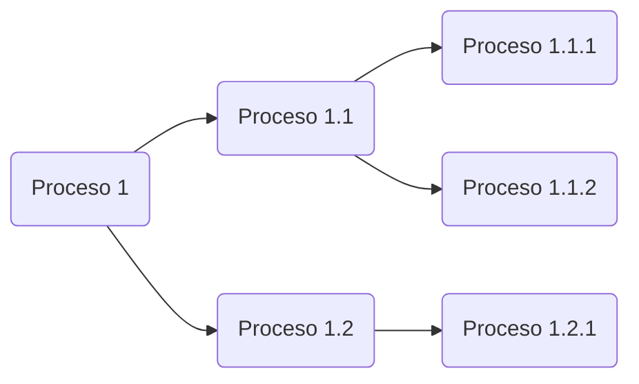

[toc]

# Sistemas multiproceso

Los ordenadores actuales realizan muchísimas tareas al mismo tiempo, pero eso no ha sido siempre así. Al principio los ordenadores se programaban/cableaban para realizar una tarea concreta, y cuando se debía realizar otra tarea, había que realizar la programación/cableado de nuevo. Generalmente esta tarea estaba asociada a las mujeres.

Más adelante en el tiempo, con la aparición de la siguiente generación de ordenadores, estos eran capaces de realizar diferentes tareas, pero no al mismo tiempo (procesos por lotes o batch).

En el siguiente escalón disponiamos de ordenadores que simulaban realizar más de una tarea al mismo tiempo, aunque realmente solo disponian de un procesador.

Solo cuando llegamos a la generación moderna de ordenadores y sistemas operativos (com más de un núcleo o procesador) es cuando se consigue realmente realizar más de una tarea de manera simultánea.

Otra visión apuesta por utilizar varios ordenadores y construir una red en la los componentes realizan el trabajo de manera distribuida.

Existen muchos términos, posibilidades, dificultades y sus correspondientes soluciones alrededor de los sistemas y programación multiproceso. En esta unidad conoceremos los cimientos que sustentan la programación multiproceso para comprender y aplicar las técnicas en nuestras soluciones de software.

Un ordenador actual es capaz de reproducir un fichero de sonido, imprimir un documento, descargar un programa de internet, recibir un correo electrónico, actualizar el sistema operativo y monitorizar la temperatura de la CPU. Pero esto debería hacer que nos preguntemos: ¿cómo puede realizar más tareas de la cantidad de núcleos o procesadores de que dispone el sistema?

La **multitarea** es la capacidad que tienen los ordenadores de realizar varias tareas al mismo tiempo, independientemente del número de núcleos o procesadores. Además puedes ser:

- **Real**: si el sistema dispone de tantos núcleos o procesadores como tareas a ejecutar simultáneamente.
- **Simulada**: el número de núcleos o procesadores es menor que el número de tareas a ejecutar al mismo tiempo.

> **¿De quien depende la capacidad de realizar multitarea?**
>
> Hay dos componentes involucrados, la parte física (hardware) a través del procesador. Y la parte lógica (software) es decir el sistema operativo. Los dos son necesarios en igual medida.

## El procesador

Uno de los elementos más importante de un sistema informático (ordenador, móvil, consola, coche, etc.) es el **procesador**. Este elemento proporciona la capacidad de ejecutar las instrucciones de los programas. Es como el cerebro del sistema.

Un **núcleo** es una unidad con capacidad de ejecución dentro de un procesador. En un sistema con un procesador y cuatro núcleos se pueden ejecutar cuatro instrucciones simultáneamente. Esto no significa que se disponga de cuatros procesadores, pero sí que se tiene mucha más capacidad de procesamiento simultáneo.

> **¿Significa todo esto que un procesador con un único núcleo no puede realizar multitarea?**
>
> La respuesta es NO. Cualquier sistema puede, ejecutar varias tareas y que parezca que las realiza todas simultáneamente. Debe dedicar una pequeña parte de tiempo de ejecución a cada tarea, de manera que no se aprecie el cambio entre ellas (denominado cambio de contexto). Esto producirá la ilusión de que las tareas se ejecutan simultáneamente.

## Sistema Operativo y lenguajes de programación

Además del hardware el sistema informático necesita disponer de un sistema operativo y programas. Ambas partes son necesarias para que el sistema realice su función. Una sin la otra no tienen sentido.

El sistema operativo hace de intermediario entre el usuario y el hardware del ordenador a través del software del mismo. Si el usuario pulsa una tecla o mueve el ratón, el sistema operativo detecta el evento y hace posible su gestión. Cuando un programa necesita acceder a una zona de memoria o de almacenamiento, es el sistema operativo el encargado de mover los cabezales o activar el chip de memoria correspondiente.

> **¿Se puede programar algo que no se sabe muy bien cómo funciona?** 
>
> En la mayoría de los casos la respuesta es afirmativa, justo ese es el trabajo del sistema operativo, no ofrece la posibilidad de generar un nuevo fichero si entrar al detalle de como reserva los sectores en el disco, como mueve el los motores o el cabezal para conseguirlo.

Los lenguajes de programación tienen diferentes formas de ser categorizados:

- **Compilados**: Son aquellos que generan un código resultante que posteriormente será ejecutado. Esto puede darse, creando un archivo ejecutable con el código máquina, preparado para su ejecución directa por la máquina física. Pero algunos lenguajes actuales también permiten compilar su código fuente dando como resultado un código intermedio, almacenado en un fichero. Este fichero es interpretado posteriormente y ejecutado directamente paso a paso (convertido paso a paso a código máquina). Los programas compilados a código nativo en tiempo de compilación, suelen ser más rápidos que los traducidos en tiempo de ejecución. Generan el problema de que el código máquina creado es dependiente de la arquitectura de la plataforma en la que se compilan y para la que se ejecutan. Ejemplos: C, C++, Visual Basic, Fortran, Pascal

  ```mermaid
  graph LR
  A(Applicación) --> B(Máquina)
  ```

  **Interpretados:** Son lenguajes cuyas instrucciones se traducen para ser **ejecutadas por la máquina hardware en el mismo momento de la ejecución**, sin crear ningún código intermedio, ni guardar el resultado de dicha traducción. Son más lentos que los lenguajes compilados debido a la necesidad de traducir a código máquina el programa, instrucción a instrucción, mientras se ejecuta. Debido a esta ejecución en tiempo real, no se traduce la totalidad del conjunto de instrucciones, sino se va traduciendo a medida que se van ejecutando cada una de ellas. Permiten ofrecer al programa interpretado un entorno **no** dependiente de la máquina donde se ejecuta el interprete, sino del propio interprete. Ejemplos: Html, Php, Python, Ruby, Javascript

  ```mermaid
  graph LR
  A(Applicación) --> C(Intérprete) --> B(Máquina)
  ```

  ### Lenguaje Intermedio

  Conocemos bajo este concepto el producto de la compilación de algunos lenguajes de alto nivel en un tipo de lenguaje ([bytecode](https://es.wikipedia.org/wiki/Bytecode)). Para mejorar el proceso de optimización o facilitar la *portabilidad*, algunas implementaciones de lenguajes de programación pueden compilar el código fuente original en una forma intermedia y después traducir (interpretar) ese al código máquina mediante una ([máquina virtual](https://es.wikipedia.org/wiki/Máquina_virtual)). Esto ocurre con lenguajes como Java o C#. 

## Programas, ejecutables, procesos y servicios

Es necesario entender las pequeñas diferencias entre los términos: Programa, proceso, ejecutable y servicio, que hacen referencia a elementos distintos, pero íntimamente relacionados.

Para llegar a poder ejecutar un programa primero hay que tenerlo disponible o crearlo para poder ejecutarlo. Si el programador escribe el código que genera el programa que posteriormente ejecutará el usuario, se seguiran los siguientes pasos:

1. El programador escribe el código fuente con un editor de texto o IDE y lo almacena en un fichero.

2. El programador compila el código fuente utilizando un compilador, generando un programa ejecutable. Este programa contiene instrucciones comprensibles por el sistema operativo para el cual se realizó la compilación.
3. El usuario ejecuta el programa ejecutable, generando un proceso.

Por tanto, un programa, al ser ejecutado por un usuario, genera un proceso en el sistema operativo: un proceso es un programa en ejecución.

Un servicio también es un programa pero su ejecución se realiza en segundo plano y no requiere la interacción del usuario. Normalmente, se arranca de manera automática por el sistema operativo y está en constante ejecución.

En linux podemos ver los procesos con el comando top o htop:


Y en Windows con el Administrador de tareas:


Es interesante señalar que en los programas interpretados o intermedios , el proceso que se arranca no es el propio programa, sino el del intérprete (como en Python) o el de la máquina virtual (como en Java). En estos casos el nombre del proceso no coincide con el nombre del programa.

Observa como en ambas capturas el número de procesos en ejecución es muy superior a la cantidad de procesadores/nucleos disponibles en el sistema.

## Computación paralela y concurrente

Prácticamente todos los sistemas operativos modernos son multitarea o multiproceso.

Un sistema que posee un único procesador de un núcleo es capaz de realiza multitarea mediante la concurrencia. Los tiempos del procesador se reparten por el planificador de procesos del Sistema Operativo. Si el sistema es suficientemente rápido y el planificador realiza su trabajo correctamente la apariencia para el usuario es que todo ser está haciendo a un mismo tiempo, aunque esto no es así.

Los sistemas con varios procesadores o con varios núcleos permiten ejecutar varias instrucciones en un único ciclo de reloj (al mismo tiempo). Esto permite ejecutar en paralelo varias instrucciones, lo que se conoce como procesamiento paralelo. Los procesos se dividen en pequeños subprocesos (hilos) que se ejecutan en los diferentes núcleos o procesadores, consiguiendo realizar el mismo trabajo de manera más rápida.

En resumen:

- **Procesamiento concurrente**. Es aquel en el que varios procesos se ejecutan en un mismo procesador/nucleo de manera alterna, consiguiendo el avance simultáneo de los mismos.

  > Hablar y comer chicle es concurrencia

- **Procesamiento paralelo**. Es aquel en el que los subprocesos (hilos) de un proceso se ejecutan de manera simultánea en los diversos procesadores/núcleos.

  > Andar y comer chicle es paralelismo

Como conclusión el procesamiento concurrente es responsabilidad del sistema operativo mientras que el procesamiento paralelo es responsabilidad compartida entre el sistema operativo y el programa (Programador).

## Programación distribuida

Otro paradigma multiproceso es la programación distribuida, donde la ejecución del software se distribuye entre varios ordenadores, para disponer de una potencia de procesamiento mucho más elevada, escalable y económica. Si en un sistema informático los núcleos/procesos disponibles son fijos y no se pueden cambiar facilmente, en un sistema distribuido esta limitación desaparece.

Para tener un sistema distribuido necesitamos una red de ordenadores. No todas las tareas son susceptibles de distribuirse ni en todos los casos se obtendrá beneficio respecto de una ejecución convencional, pero si se puede aprovechar esa ventaja el sistema será mucho más eficiente y requerirá una inversión inferior que conseguir un único sistema con la misma potencia.

> Por muchas elefantas que pongas a gestar, su embarazo durará 22 meses

Procesamiento distribuido es aquel en el que un proceso se ejecuta en núcleos/procesadores independientes conectados y sincronizados a través de una red.

## Hilos

Un programa básico está compuesto por una serie de sentencias que se ejecutan de manera secuencial y síncrona: hasta que no se completa la ejecución de la primera de las sentencias no se comienza con la ejecución de la segunda, y así sucesivamente hasta terminar la ejecución del programa completo.

En muchos casos, es necesaria esta secuencialidad y sincronía, ya que los diferentes pasos del algoritmo programado son dependientes entre sí y no existe la posibilidad de invertir el orden de ejecución sin generar un resultado del proceso erróneo. En otros casos, en cambio, un algoritmo podría trocearse en varias unidades más pequeñas, ejecutar cada una de ellas por separado y en paralelo, juntar los resultados sin que importe el orden en que se obtengan y generar el resultado final. Esta técnica se conoce como pro-
gramación multihilo.

Los hilos de ejecución son fracciones de programa que, si cumplen con determinadas características, pueden ejecutarse simultáneamente gracias al procesamiento paralelo.

Al formar parte del mismo proceso son extremadamente económicos en referencia a los recursos que utilizan.

Los programas que se ejecutan en un único hilo se denominan programas monohilo, mientras que los que se ejecutan en varios hilos se conocen como programas multihilo.

## `Fork` (bifurcación)

Una bifurcación/fork, es una copia idéntica de un proceso. El proceso original se denomina **padre** y sus copias, **hijos**, teniendo todos ellos diferentes identificadores de proceso (PID). La copia creada continúa con el estado del proceso original (padre), pero a partir de la creación cada proceso mantiene su propio estado de memoria.

>En Java existe el framework Fork/Join desde la versión 7. Que Proporciona herramientas aprovechar los núcleos del sistema operativo y realizar procesamiento paralelo.

##  Problemas inherentes a la programación concurrente

A la hora de crear un programa concurrente podemos encontramos con dos problemas:

- **Exclusión mutua**. En programación concurrente es muy típico que varios procesos accedan a la vez a una variable compartida para actualizarla. Esto se debe evitar, ya que puede producir inconsistencia de datos: uno puede estar actualizando la variable a la vez que otro la puede estar leyendo. Por ello es necesario conseguir la exclusión mutua de los procesos respecto a la variable compartida. Para ello se propuso la **región crítica**. Cuando dos o más procesos comparten una variable, el acceso a dicha variable debe efectuarse siempre dentro de la región crítica asociada a la variable. Solo uno de los procesos podrá acceder para actualizarla y los demás deberán esperar,
  el tiempo de estancia es finito.
  
  > Ejemplos de variables compartidas pueden ser:
  >
  > - El stock de un producto para una tienda online
  > - Tu saldo en la entidad bancaria
  
- **Condición de sincronización**. Hace referencia a la necesidad de coordinar los procesos con el fin de sincronizar sus actividades. Puede ocurrir que un proceso P1 llegue a un estado X que no pueda continuar su ejecución hasta que otro proceso P2 haya llegado a un estado Y de su ejecución. La programación concurrente proporciona mecanismos para bloquear procesos a la espera de que ocurra un evento y para desbloquearlos cuando este ocurra.

Algunas herramientas para manejar la concurrencia son: la región crítica, los semáforos, región crítica condicional, buzones, sucesos, monitores y sincronización por rendez-vous.

# Procesos

Se puede definir un proceso como un programa en ejecución. Consiste básicamente en el código ejecutable del programa, los datos, la pila del programa, el contador de programa, el puntero de pila y otros registros, y toda la información necesaria para ejecutar el programa.

Todos los programas que se ejecutan en el ordenador se organizan como un conjunto de procesos. El sistema operativo decide parar la ejecución de un proceso, por ejemplo porque ha consumido su tiempo de CPU, y arrancar la de otro. Cuando se suspende temporalmente la ejecución de un proceso debe rearrancarse posteriormente en el mismo estado en que se encontraba cuando se paró, esto implica que toda la información referente al proceso debe almacenarse en alguna parte.

El **BCP** es una estructura de datos llamada **Bloque de Control de Proceso** donde se almacena información acerca de un proceso:

- Identificación del proceso (PID). Cada proceso que se inicia es referenciado por un identificador único.

* Estado del proceso.
* Contador de programa.
* Registros de CPU.
* Información de planificación de CPU como la prioridad del proceso.
* Información de gestión de memoria.
* Información contable como la cantidad de tiempo de CPU y tiempo real consumido.
* Información de estado de E/S como la lista de dispositivos asignados, archivos abiertos, etc.

## Gestión y estados de procesos

Los procesos necesitan recursos y estos son limitados. El procesador, la memoria, el acceso a los sistemas de almacenamiento o a los diferentes dispositivos son algunos de ellos. La pregunta que surge como consecuencia de esta afirmación es la siguiente:

> ¿cómo se consigue que la convivencia entre los procesos, que compiten entre sí por los limitados recursos del sistema de computación, sea posible? 
>
> La respuesta está en el sistema operativo y, más concretamente, en el planificador de procesos.

El **planificador de procesos** es el elemento del sistema operativo que se encarga de repartir los recursos del sistema entre los procesos que los demandan. De hecho, es uno de sus componentes fundamentales, ya que determina la calidad del multiproceso del sistema y, como consecuencia, la eficiencia en el aprovechamiento de los recursos. 

Los objetivos del planificador son los siguientes:

- Maximizar el rendimiento del sistema.
- Maximizar la equidad en el del reparto de los recursos.
- Minimizar los tiempos de espera.
- Minimizar los tiempos de respuesta.

Se puede sintetizar que el objetivo del planificador es conseguir que todos los procesos terminen lo antes posible aprovechando al máximo los recursos del sistema. La tarea, como se puede suponer, es compleja.

> El planificador muchas veces se basa en estadisticas de conjuntos de procesos ya ejecutados, puede ser dificil a priori estimar la necesidad de recursos de un proceso que todavía no se ha ejecutado, esto hace que diseñar un buen planificador sea crítico y al mismo tiempo muy complicado. Puede ser óptimo para un conjunto de procesos determinado y un desastre para otro.

Existen muchos algoritmos para la planificación de los procesos, pero su enumeración y explicación están fuera del alcance de este libro. No obstante, hay que considerar que cada sistema operativo utiliza sus propias estrategias de gestión de recursos a distintos niveles y que dichas estrategias influyen de manera directa en el funcionamiento del sistema.

Un proceso aunque es una entidad independiente puede generar una salida que se use como entrada para otro proceso. Entonces este segundo proceso tendrá que esperar a que el primero termine para obtener los datos a procesar, en este caso debe bloquearse hasta que sus datos de entrada estén disponibles. Un proceso también se puede parar porque el sistema operativo decida asignar el procesador a otro proceso. En definitiva, el diagrama de estados en los que se pueden encontrar un proceso son los siguientes:


- **Nuevo**: El proceso está recien creado y listo para ser admitido.

- **Listo**: El proceso ha sido admitido y está listo para ejecutarse. También puede llegar aquí después de haber sido interrumpido o porque se ha completado una Entrada/Salida o evento.
- **En ejecución**: el proceso está actualmente ejecutándose, es decir, usando el procesador (la decisión la toma el planificador). Si llega alguna interrupción (por ejemplo porque otro proceso tiene más prioridad o estaba esperando un recurso que estaba ocupado), el proceso se devuelve al estado de **Listo**. Si por el contrario termina todas las operaciones que tenia asignadas pasará al estado de **Terminado**.
- **En espera**: Si estando en ejecución el proceso necesita Entrada/Salida o algun evento, pasará al estado **Listo** hasta que se complete esta tarea.
- **Terminado**: El proceso ha completado todas sus tareas y sale del sistema.

## Comunicación entre procesos

Por definición, los procesos de un sistema son elementos estancos. Cada uno tiene su espacio de memoria, su tiempo de CPU asignado por el planificador y su estado de los registros. No obstante, los procesos deben poder comunicarse entre sí, ya que es natural que surjan dependencias entre ellos en lo referente a las entradas y salidas de datos.

La comunicación entre procesos se denomina IPC (Inter-Process Communication) y existen diversas alternativas para llevarla a cabo. Algunas de estas alternativas son las siguientes:

- **Utilización de sockets**. Los sockets son mecanismos de comunicación de bajo nivel. Permiten establecer canales de comunicación de bytes bidireccionales entre procesos alojados en distintas máquinas y programados con diferentes lenguajes. Gracias a los sockets dos procesos pueden intercambiar cualquier tipo de información. 
- **Utilización de flujos de entrada y salida**. Los procesos pueden interceptar los flujos de entrada y salida estándar, por lo que pueden leer y escribir información unos en otros. En este caso, los procesos deben estar relacionados previamente (uno de ellos debe haber arrancado al otro obteniendo una referencia al mismo).
- **RPC**. Llamada a procedimiento remoto (**Remote Process Call**, en inglés). Consiste en realizar llamadas a métodos de otros procesos que, potencialmente, pueden estar ejecutándose en otras máquinas. Desde el punto de vista del proceso que realiza la llamada, la ubicación de los procesos llamados es transparente. En Java, este tipo de llamada se realiza mediante la tecnología conocida como **RMI** (**Remote Method Invocation**), equivalente a las RPC, pero orientada a objetos.
- Mediante el uso de **sistemas de persistencia**. Consiste en realizar escrituras y lecturas desde los distintos procesos en cualquier tipo de sistema de persistencia, como los ficheros o las bases de datos. Pese a su sencillez, no se puede ignorar esta alternativa, ya que puede ser suficiente en múltiples ocasiones.
- Mediante el uso de **servicios proporcionados a través de internet**. Los procesos pueden utilizar servicios de transferencia de ficheros FTP, aplicaciones o servicios web, así como la tecnología cloud como mecanismos de conexión entre procesos que permiten el intercambio de información.

## Sincronización de procesos

Todos los sistemas en los que participan múltiples actores de manera concurrente están sometidos a ciertas condiciones que exigen que exista sincronización entre ellos. Por ejemplo, puede que sea necesario saber si un proceso ha terminado satisfactoriamente para ejecutar el siguiente que se encuentra en un flujo de procesos o, en caso de que haya ocurrido un determinado error, ejecutar otro proceso alternativo.

Es el planificador del sistema operativo el encargado de decidir en qué momento tiene acceso a los recursos un proceso, pero a nivel general, la decisión de crear y lanzar un proceso es humana y expresada a través de un algoritmo.

En la siguiente figura se muestra un posible ejemplo de flujo de ejecución de un conjunto de procesos. 



Las condiciones que determinan dicho flujo son las siguientes:

El proceso `Proceso 1` se ejecuta inicialmente.

- Si el código de finalización de `Proceso 1` es 0, se ejecuta el proceso `Proceso 1.1`.
  - Si el código de finalización de `Proceso 1.1` es 0, se ejecuta el proceso `Proceso 1.1.1`.
  - Si el código de finalización de `Proceso 1.1` es 1, se ejecuta el proceso `Proceso 1.1.2`.
- Si el código de finalización de `Proceso 1` es 1, se ejecuta el proceso `Proceso 1.2`.
  - Independientemente del código de finalización del proceso `Proceso 1.2`, pero únicamente cuando haya finalizado, se ejecuta el proceso `Proceso 1.2.1`.

Para gestionar un flujo de trabajo como el presentado en el ejemplo se necesita disponer de los siguientes mecanismos:

- **Ejecución**. Un mecanismo para ejecutar procesos desde un proceso.
- **Espera**. Un mecanismo para bloquear la ejecución de un proceso a la espera de que otro proceso termine.
- **Generación de código de terminación**. Un mecanismo de comunicación que permita indicar a un proceso cómo ha terminado la ejecución mediante un código.
- **Obtención el código de terminación**. Un mecanismo que permita a un proceso obtener el código de terminación de otro proceso.

En Java, estas necesidades se satisfacen con las clases y métodos que se muestran en la siguiente tabla:

| Mecanismo                           | Clase            | Método                   |
| ----------------------------------- | ---------------- | ------------------------ |
| Ejecución                           | `Runtime`        | `exec()`                 |
| Ejecución                           | `ProcessBuilder` | `start()`                |
| Espera                              | `Process`        | `waitFor()`              |
| Generación de código de terminación | `System`         | `exit(valor_de_retorno)` |
| Obtención de código de terminación  | `Process`        | `waitFor()`              |

# Programación multiprocesos en Java

Cada instancia de una aplicación en ejecución es un proceso. Cada proceso dispone de un conjunto de instrucciones, un estado de los registros del procesador, un espacio de memoria y un estado en lo referente a la gestión que hace de él el planificador del sistema operativo. 

> ¿Tiene sentido, por lo tanto, hablar de programación de aplicaciones multiprocesos si una aplicación cuando se ejecuta constituye uno único?
>
> La respuesta es sí, siempre y cuando se acote el significado del concepto «aplicación multiproceso», ya que se trata de un término cuyo alcance es difuso. En esta unidad se aborda la programación de aplicaciones multiproceso como la capacidad de coordinar la ejecución de un conjunto de aplicaciones para lograr un objetivo común.

Por ejemplo, si se dispone de un sistema compuesto por un conjunto de procesos que deben ejecutarse de manera individual, pero que tienen dependencias entre sí, se necesita disponer de un mecanismo de gestión y coordinación.

En Java, la creación de un proceso se puede realizar de dos maneras diferentes:

- Utilizando la clase `java.lang.Runtime`.
- Utilizando la clase `java.lang.ProcessBuilder`.

## Creación de procesos con `Runtime`

Toda aplicación Java tiene una única instancia de la clase Runtime que permite que la propia aplicación interactúe con su entorno de ejecución a través del método estático getRuntime. Este método proporciona un «canal» de comunicación entre la aplicación y su entorno, posibilitando la interacción con el sistema operativo a través del método exec.

El siguiente código Java genera un proceso en Windows indicando al entorno de ejecución (al sistema operativo) que ejecute el bloc de notas a través del programa «Notepad.exe». En este caso, la llamada se realiza sin parámetros y sin gestionar de ninguna manera el proceso generado.

```java
Runtime.getRuntime().exec("Notepad.exe");
```

En muchos casos, los procesos necesitan parámetros para iniciarse. El método exec puede recibir una cadena de caracteres (un objeto de la clase String) y en dicha cadena, separados por espacios, se indicarán, además del programa que se desea ejecutar, los diferentes parámetros.

En el siguiente código se está ejecutando el bloc de notas indicando que «notas.txt» es el fichero que debe abrir o crear si no existe.

```java
Runtime.getRuntime().exec("Notepad.exe notas.txt");
```

Alternativamente, se puede crear el proceso proporcionando un array de objetos String con el nombre del programa y los parámetros.

```java
String[] infoProceso = ("Notepad.exe","notas.txt");
Runtime.getRuntime().exec(infoProceso);
```

El siguiente nivel consiste en gestionar el proceso lanzado. Para ello, se debe obtener la referencia a la instancia de la clase Process proporcionada por el método exec. Es este objeto el que proporciona los métodos para conocer el estado de la ejecución del proceso.

```java
String[] infoProceso = ("Notepad.exe","notas.txt");
Process proceso = Runtime.getRuntime().exec(infoProceso) ;
```

Si se necesita esperar a que el proceso ejecutado termine y conocer el estado en que ha finalizado dicha ejecución, se puede utilizar el método waitFor. Este método suspende la ejecución del programa que ha arrancado el proceso quedando a la espera de que este termine, proporcionando además el código de finalización.

```java
String[] infoProceso = ("Notepad.exe","notas.txt");
Process proceso = Runtime.getRuntime().exec(infoProceso);
int codigoRetorno = proceso.waitFor();
System.out.println("Fin de la ejecución:" + codigoRetorno);
```

La clase `Process` representa al proceso en ejecución y permite obtener información sobre este. Los principales métodos que proporciona dicha clase son los que se recogen en la siguiente tabla:

| Método              | Descripción                                                  |
| ------------------- | ------------------------------------------------------------ |
| `destroy()`         | Destruye el proceso sobre el que se ejecuta.                 |
| `exitValue()`       | Devuelve el valor de retorno del proceso cuando este finaliza. Sirve para controlar el estado de la ejecución. : |
| `getErrorStream()`  | Proporciona un `InputStream` conectado a la salida de error del proceso. |
| `getinputStream()`  | Proporciona un `InputStream` conectado a la salida normal del proceso. |
| `getOutputStream()` | Proporciona un `OutputStream` conectado a la entrada normal del proceso. |
| `isAlive()`         | Determina si el proceso está o no en ejecución.              |
| `waitFor()`         | Detiene la ejecución del programa que lanza el proceso a la espera de que este último termine. |

> Más información: [API de Java 8](https://docs.oracle.com/javase/8/docs/api/java/lang/)

## Creación de procesos con `ProcessBuilder`

La clase ProccessBuilder permite, al igual que Runtime, crear procesos.

La creación más sencilla de un proceso se realiza con un único parámetro en el que se indica el programa a ejecutar. Es importante saber que esta construcción no supone la ejecución del proceso.

```java
new ProcessBuilder("Notepad.exe");
```

La ejecución del proceso se realiza a partir de la invocación al método start:

```java
new ProcessBuilder("Notepad.exe").start();
```

El constructor de ProcessBuilder admite parámetros que serán entregados al proceso que se crea.

```java
new ProcessBuilder("Notepad.exe","datos.txt").start();
```

Al igual que ocurre con el método exec de la clase Runtime, el método start de ProcessBuilder proporciona un proceso como retorno, lo que posibilita la sincronización y gestión de este.

```java
Process proceso = new ProcessBuilder("Notepad.exe", "datos.txt").start();
int valorRetorno = proceso.waitFor();
System.out.println("Valor retorno:" + valorRetorno);
```

El método start permite crear múltiples subprocesos a partir de una única instancia de ProccessBuilder. El siguiente código crea diez instancias del bloc de notas de Windows.

```java
ProcessBuilder pBuilder = new ProcessBuilder("Notepad.exe");
for (int i=0; i<10;i++){
	pBuilder.start();
}
```

Además del método start, la clase ProcessBuilder dispone de métodos para consultar y gestionar algunos parámetros relativos a la ejecución del proceso. Los métodos más relevantes de ProcessBuilder se muestran en la siguiente tabla:

| Método           | Descripción                                                  |
| ---------------- | ------------------------------------------------------------ |
| `start`          | Inicia  un  nuevo  proceso  usando  los atributos  especificados. |
| `command`        | Permite obtener  o  asignar el  programa  y los  argumentos de la instancia de ProcessBuilder. |
| `directory`      | Permite obtener  o  asignar el  directorio  de  trabajo del  proceso. |
| `environment`    | Proporciona información  sobre el entorno  de  ejecución del  proceso. |
| `redirectError`  | Permite determinar  el destino  de la salida de  errores.    |
| `redirectInput`  | Permite  determinar  el  origen de  la entrada  estándar.    |
| `redirectOutput` | Permite determinar  el destino  de la salida estándar.       |

A continuación, se muestran algunos ejemplos relacionados con los métodos expuestos.

El siguiente código crea un objeto ProcessBuilder y determina el directorio de trabajo del proceso:

```java
ProcessBuilder pBuilder = new ProcessBuilder ("Notepad.exe", "datos.txt");
PBuilder.directory (new File("c:/directorio_salida/"));
```

Para acceder a la información del entorno de ejecución, el método environment devuelve un objeto Map con la información proporcionada por el sistema operativo. El siguiente ejemplo muestra por pantalla el número de procesadores disponibles en el sistema:

```java
ProcessBuilder pBuilder = new ProcessBuilder("Notepad.exe","datos.txt");
java.util.Map<String, String> env = pBuilder.environment();
System.out.println("Número de procesadores:" + env.get ("NUMBER_OF_PROCESSORS"));
```

# Fuentes de información

- [Wikipedia](https://es.wikipedia.org)
- [Programación de servicios y procesos - FERNANDO PANIAGUA MARTÍN [Paraninfo]](https://www.paraninfo.es/catalogo/9788413665269/programacion-de-servicios-y-procesos)
- [Programación de Servicios y Procesos - ALBERTO SÁNCHEZ CAMPOS [Ra-ma]](https://www.ra-ma.es/libro/programacion-de-servicios-y-procesos-grado-superior_49240/)
- [Programación de Servicios y Procesos - Mª JESÚS RAMOS MARTÍN - [Garceta] (1ª Edición)](https://www.garceta.es)
- [Programación de servicios y procesos - CARLOS ALBERTO CORTIJO BON [Sintesis]](https://www.sintesis.com/desarrollo%20de%20aplicaciones%20multiplataforma-341/programaci%C3%B3n%20de%20servicios%20y%20procesos-ebook-2910.html)
- [Programació de serveis i processos - JOAR ARNEDO MORENO, JOSEP CAÑELLAS BORNAS i JOSÉ ANTONIO LEO MEGÍAS [IOC]](https://ioc.xtec.cat/materials/FP/Recursos/fp_dam_m09_/web/fp_dam_m09_htmlindex/index.html)
-  GitHub repositories:
  - https://github.com/ajcpro/psp
  - https://oscarmaestre.github.io/servicios/index.html
  - https://github.com/juanro49/DAM/tree/master/DAM2/PSP
  - https://github.com/pablohs1986/dam_psp2021
  - https://github.com/Perju/DAM
  - https://github.com/eldiegoch/DAM
  - https://github.com/eldiegoch/2dam-psp-public
  - https://github.com/franlu/DAM-PSP
  - https://github.com/ProgProcesosYServicios
  - https://github.com/joseluisgs
  - https://github.com/oscarnovillo/dam2_2122
  - https://github.com/PacoPortillo/DAM_PSP_Tarea02_La-Cena-de-los-Filosofos