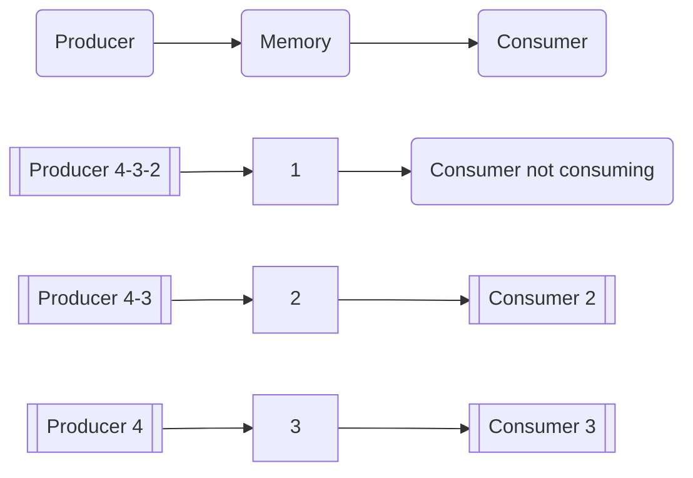
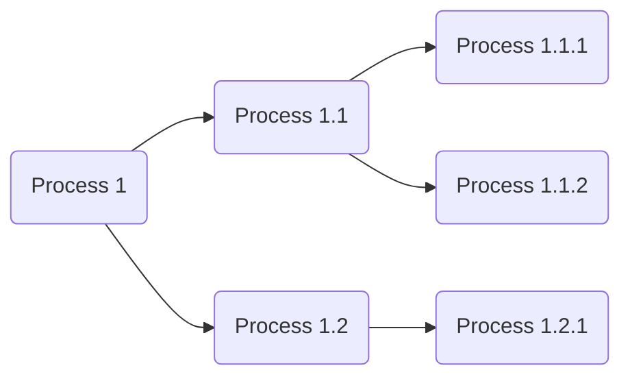

---
title: UD01: Programación multiproceso
language: ES
author: David Martínez Peña [www.martinezpenya.es]
subject: Programación de Servicios y Procesos
keywords: [PSP, 2022, Programacion, servicios, procesos, multihilo, Java]
IES: IES Eduardo Primo Marqués (Carlet) [www.ieseduardoprimo.es]
header: ${title} - ${subject} (ver. ${today}) 
footer:${currentFileName}.pdf - ${author} - ${IES} - ${pageNo}/${pageCount}
typora-root-url:${filename}/../
typora-copy-images-to:${filename}/../assets
imgcover:/media/DADES/NextCloud/DOCENCIA/PSP_2223/PSP-CFGS-2223/UD01/assets/cover.png
---
[toc]

# Sistemas multiproceso

Los ordenadores actuales realizan muchísimas tareas al mismo tiempo, pero eso no ha sido siempre así. Al principio los ordenadores se programaban/cableaban para realizar una tarea concreta, y cuando se debía realizar otra tarea, había que realizar la programación/cableado de nuevo. Generalmente esta tarea estaba asociada a las mujeres.

Más adelante en el tiempo, con la aparición de la siguiente generación de ordenadores, estos eran capaces de realizar diferentes tareas, pero no al mismo tiempo (procesos por lotes o batch).

En el siguiente escalón disponiamos de ordenadores que simulaban realizar más de una tarea al mismo tiempo, aunque realmente solo disponian de un procesador.

Solo cuando llegamos a la generación moderna de ordenadores y sistemas operativos (com más de un núcleo o procesador) es cuando se consigue realmente realizar más de una tarea de manera simultánea.

Otra visión apuesta por utilizar varios ordenadores y construir una red en la los componentes realizan el trabajo de manera distribuida.

Existen muchos términos, posibilidades, dificultades y sus correspondientes soluciones alrededor de los sistemas y programación multiproceso. En esta unidad conoceremos los cimientos que sustentan la programación multiproceso para comprender y aplicar las técnicas en nuestras soluciones de software.

Un ordenador actual es capaz de reproducir un fichero de sonido, imprimir un documento, descargar un programa de internet, recibir un correo electrónico, actualizar el sistema operativo y monitorizar la temperatura de la CPU. Pero esto debería hacer que nos preguntemos: ¿cómo puede realizar más tareas de la cantidad de núcleos o procesadores de que dispone el sistema?

La **multitarea** es la capacidad que tienen los ordenadores de realizar varias tareas al mismo tiempo, independientemente del número de núcleos o procesadores. Además puedes ser:

- **Real**: si el sistema dispone de tantos núcleos o procesadores como tareas a ejecutar simultáneamente.
- **Simulada**: el número de núcleos o procesadores es menor que el número de tareas a ejecutar al mismo tiempo.

> **¿De quien depende la capacidad de realizar multitarea?**
>
> Hay dos componentes involucrados, la parte física (hardware) a través del procesador. Y la parte lógica (software) es decir el sistema operativo. Los dos son necesarios en igual medida.

## El procesador

Uno de los elementos más importante de un sistema informático (ordenador, móvil, consola, coche, etc.) es el **procesador**. Este elemento proporciona la capacidad de ejecutar las instrucciones de los programas. Es como el cerebro del sistema.

Un **núcleo** es una unidad con capacidad de ejecución dentro de un procesador. En un sistema con un procesador y cuatro núcleos se pueden ejecutar cuatro instrucciones simultáneamente. Esto no significa que se disponga de cuatros procesadores, pero sí que se tiene mucha más capacidad de procesamiento simultáneo.


> **¿Significa todo esto que un procesador con un único núcleo no puede realizar multitarea?**
>
> La respuesta es NO. Cualquier sistema puede, ejecutar varias tareas y que parezca que las realiza todas simultáneamente. Debe dedicar una pequeña parte de tiempo de ejecución a cada tarea, de manera que no se aprecie el cambio entre ellas (denominado cambio de contexto). Esto producirá la ilusión de que las tareas se ejecutan simultáneamente.

## Sistema Operativo y lenguajes de programación

Además del hardware el sistema informático necesita disponer de un sistema operativo y programas. Ambas partes son necesarias para que el sistema realice su función. Una sin la otra no tienen sentido.

El sistema operativo hace de intermediario entre el usuario y el hardware del ordenador a través del software del mismo. Si el usuario pulsa una tecla o mueve el ratón, el sistema operativo detecta el evento y hace posible su gestión. Cuando un programa necesita acceder a una zona de memoria o de almacenamiento, es el sistema operativo el encargado de mover los cabezales o activar el chip de memoria correspondiente.

> **¿Se puede programar algo que no se sabe muy bien cómo funciona?** 
>
> En la mayoría de los casos la respuesta es afirmativa, justo ese es el trabajo del sistema operativo, no ofrece la posibilidad de generar un nuevo fichero si entrar al detalle de como reserva los sectores en el disco, como mueve el los motores o el cabezal para conseguirlo.

Los lenguajes de programación tienen diferentes formas de ser categorizados:

- **Compilados**: Son aquellos que generan un código resultante que posteriormente será ejecutado. Esto puede darse, creando un archivo ejecutable con el código máquina, preparado para su ejecución directa por la máquina física. Pero algunos lenguajes actuales también permiten compilar su código fuente dando como resultado un código intermedio, almacenado en un fichero. Este fichero es interpretado posteriormente y ejecutado directamente paso a paso (convertido paso a paso a código máquina). Los programas compilados a código nativo en tiempo de compilación, suelen ser más rápidos que los traducidos en tiempo de ejecución. Generan el problema de que el código máquina creado es dependiente de la arquitectura de la plataforma en la que se compilan y para la que se ejecutan. Ejemplos: C, C++, Visual Basic, Fortran, Pascal

  ```mermaid
  graph LR
  A(Application) --> B(Machine)
  ```

  **Interpretados:** Son lenguajes cuyas instrucciones se traducen para ser **ejecutadas por la máquina hardware en el mismo momento de la ejecución**, sin crear ningún código intermedio, ni guardar el resultado de dicha traducción. Son más lentos que los lenguajes compilados debido a la necesidad de traducir a código máquina el programa, instrucción a instrucción, mientras se ejecuta. Debido a esta ejecución en tiempo real, no se traduce la totalidad del conjunto de instrucciones, sino se va traduciendo a medida que se van ejecutando cada una de ellas. Permiten ofrecer al programa interpretado un entorno **no** dependiente de la máquina donde se ejecuta el interprete, sino del propio interprete. Ejemplos: Html, Php, Python, Ruby, Javascript

  ```mermaid
  graph LR
  A(Application) --> C(Interpreter) --> B(Machine)
  ```

  ### Lenguaje Intermedio

  Conocemos bajo este concepto el producto de la compilación de algunos lenguajes de alto nivel en un tipo de lenguaje ([bytecode](https://es.wikipedia.org/wiki/Bytecode)). Para mejorar el proceso de optimización o facilitar la *portabilidad*, algunas implementaciones de lenguajes de programación pueden compilar el código fuente original en una forma intermedia y después traducir (interpretar) ese al código máquina mediante una ([máquina virtual](https://es.wikipedia.org/wiki/Máquina_virtual)). Esto ocurre con lenguajes como Java o C#. 

## Programas, ejecutables, procesos y servicios

Es necesario entender las pequeñas diferencias entre los términos: Programa, proceso, ejecutable y servicio, que hacen referencia a elementos distintos, pero íntimamente relacionados.

Para llegar a poder ejecutar un programa primero hay que tenerlo disponible o crearlo para poder ejecutarlo. Si el programador escribe el código que genera el programa que posteriormente ejecutará el usuario, se seguiran los siguientes pasos:

1. El programador escribe el código fuente con un editor de texto o IDE y lo almacena en un fichero.

2. El programador compila el código fuente utilizando un compilador, generando un programa ejecutable. Este programa contiene instrucciones comprensibles por el sistema operativo para el cual se realizó la compilación.
3. El usuario ejecuta el programa ejecutable, generando un proceso.

Por tanto, un programa, al ser ejecutado por un usuario, genera un proceso en el sistema operativo: un proceso es un programa en ejecución.

Un servicio también es un programa pero su ejecución se realiza en segundo plano y no requiere la interacción del usuario. Normalmente, se arranca de manera automática por el sistema operativo y está en constante ejecución.

En linux podemos ver los procesos con el comando `top` o `htop`:


Y en Windows con el Administrador de tareas:


Es interesante señalar que en los programas interpretados o intermedios, el proceso que se arranca no es el propio programa, sino el del intérprete (como en `Python`) o el de la máquina virtual (como en `Java`). En estos casos el nombre del proceso no coincide con el nombre del programa.

Observa como en ambas capturas el número de procesos en ejecución es muy superior a la cantidad de procesadores/nucleos disponibles en el sistema.

## Computación paralela y concurrente

Prácticamente todos los sistemas operativos modernos son multitarea o multiproceso.

Un sistema que posee un único procesador de un núcleo es capaz de realizar multitarea mediante la concurrencia. Los tiempos del procesador se reparten por el planificador de procesos del Sistema Operativo. Si el sistema es suficientemente rápido y el planificador realiza su trabajo correctamente la apariencia para el usuario es que todo ser está haciendo a un mismo tiempo, aunque esto no es así.

Los sistemas con varios procesadores o con varios núcleos permiten ejecutar varias instrucciones en un único ciclo de reloj (al mismo tiempo). Esto permite ejecutar en paralelo varias instrucciones, lo que se conoce como procesamiento paralelo. Los procesos se dividen en pequeños subprocesos (hilos) que se ejecutan en los diferentes núcleos o procesadores, consiguiendo realizar el mismo trabajo de manera más rápida.

En resumen:

- **Procesamiento concurrente**. Es aquel en el que varios procesos se ejecutan en un mismo procesador/nucleo de manera alterna, consiguiendo el avance simultáneo de los mismos.

  > Hablar y comer chicle es concurrencia

- **Procesamiento paralelo**. Es aquel en el que los subprocesos (hilos) de un proceso se ejecutan de manera simultánea en los diversos procesadores/núcleos.

  > Andar y comer chicle es paralelismo

Como conclusión el procesamiento concurrente es responsabilidad del sistema operativo mientras que el procesamiento paralelo es responsabilidad compartida entre el sistema operativo y el programa (Programador).

## Programación distribuida

Otro paradigma multiproceso es la programación distribuida, donde la ejecución del software se distribuye entre varios ordenadores, para disponer de una potencia de procesamiento mucho más elevada, escalable y económica. Si en un sistema informático los núcleos/procesos disponibles son fijos y no se pueden cambiar facilmente, en un sistema distribuido esta limitación desaparece.

Para tener un sistema distribuido necesitamos una red de ordenadores. No todas las tareas son susceptibles de distribuirse ni en todos los casos se obtendrá beneficio respecto de una ejecución convencional, pero si se puede aprovechar esa ventaja el sistema será mucho más eficiente y requerirá una inversión inferior que conseguir un único sistema con la misma potencia.

> Por muchas elefantas que pongas a gestar, su embarazo durará 22 meses

Procesamiento distribuido es aquel en el que un proceso se ejecuta en núcleos/procesadores independientes conectados y sincronizados a través de una red.

## Hilos

Un programa básico está compuesto por una serie de sentencias que se ejecutan de manera secuencial y síncrona: hasta que no se completa la ejecución de la primera de las sentencias no se comienza con la ejecución de la segunda, y así sucesivamente hasta terminar la ejecución del programa completo.

En muchos casos, es necesaria esta secuencialidad y sincronía, ya que los diferentes pasos del algoritmo programado son dependientes entre sí y no existe la posibilidad de invertir el orden de ejecución sin generar un resultado del proceso erróneo. En otros casos, en cambio, un algoritmo podría trocearse en varias unidades más pequeñas, ejecutar cada una de ellas por separado y en paralelo, juntar los resultados sin que importe el orden en que se obtengan y generar el resultado final. Esta técnica se conoce como pro-
gramación multihilo.

Los hilos de ejecución son fracciones de programa que, si cumplen con determinadas características, pueden ejecutarse simultáneamente gracias al procesamiento paralelo.

Al formar parte del mismo proceso son extremadamente económicos en referencia a los recursos que utilizan.

Los programas que se ejecutan en un único hilo se denominan programas **monohilo**, mientras que los que se ejecutan en varios hilos se conocen como programas **multihilo**.

## `Fork` (bifurcación)

Una bifurcación/fork, es una copia idéntica de un proceso. El proceso original se denomina **padre** y sus copias, **hijos**, teniendo todos ellos diferentes identificadores de proceso (PID). La copia creada continúa con el estado del proceso original (padre), pero a partir de la creación cada proceso mantiene su propio estado de memoria.

>En `Java` existe el framework Fork/Join desde la versión 7. Que Proporciona herramientas aprovechar los núcleos del sistema operativo y realizar procesamiento paralelo.

Consulta el [Ejemplo01](##Ejemplo01)

##  Problemas de la programación concurrente

A la hora de crear un programa concurrente podemos encontramos con varios problemas:

### Secciones críticas

Las secciones críticas son uno de los problemas que con mayor frecuencia se dan en programación concurrente. Tenemos varios procesos que se ejecutan de forma concurrente y cada uno de ellos tiene una parte de código que debe ejecutarse de forma exclusiva ya que accede a recursos compartidos como archivos, variables comunes, registros de bases de datos, etc .

La solución pasará por obligar a acceder a los recursos a través de la ejecución de un código que llamaremos **sección crítica** y que nos permitirá proteger aquellos recursos con mecanismos que impidan la ejecución simultánea de dos o más procesos dentro de los límites de la sección crítica .

Estos algoritmos de sincronización que eviten el acceso a una región crítica por más de un hilo o proceso y que garantizan que únicamente un proceso estará haciendo uso de este recurso y el resto que quieren utilizarlo estarán a la espera de que sea liberado, se llama **algoritmo de exclusión mutua**.

> Exclusión mutua (**MUTEX**, mutual exclusion en inglés) es el tipo de sincronización que impide que dos procesos ejecuten simultáneamente una misma sección crítica.

Un mecanismo de sincronización en forma de código que proteja a la sección crítica deberá tener una forma como el siguiente:


```java
Enter_MUTEX // request to execute critical section
/* Critical section code */
Exit_MUTEX // another process can run the critical section
```

`Enter_MUTEX` representa la parte del código en la que los procesos piden permiso para entrar en la sección crítica. La `Exit_MUTEX` en cambio, representa la parte que ejecutan los procesos cuando salen de la sección crítica liberando la sección y permite a otros procesos entrar en ella.

Para validar cualquier mecanismo de sincronización de una sección crítica deben cumplirse los siguientes criterios:

- **Exclusión mutua:** no puede haber más de un proceso simultáneamente en la sección crítica.
- **No inanición:** un proceso no puede esperar un tiempo indefinido para entrar a ejecutar la sección crítica.
- **No interbloqueo:** ningún proceso de fuera de la sección crítica puede impedir que otro proceso entre en la sección crítica.
- **Independencia del hardware:** inicialmente no deben realizarse suposiciones respecto al número de procesadores o la velocidad de los procesos.

Un error de consistencia típico cuando no existe control sobre una sección crítica se puede ilustrar con el ejemplo de dos procesos que quieren modificar una variable común `x`. El proceso `A` quiere incrementarla: `x++`. El proceso `B` disminuyó: `x--`. Si ambos procesos acceden a leer el contenido de la variable al mismo tiempo, ambos obtendrán el mismo valor, si realizan su operación y guardan el resultado, éste será inesperado. Dependerá de quien salve el valor de `x` en último lugar.

La tabla inferior muestra un ejemplo similar. Un código es accesible por dos hilos o procesos, vemos que si no existe ningún tipo de control sobre el acceso, el primer hilo accede a las instrucciones y antes de llegar a la instrucción de incremento de la variable a++, el segundo proceso entra a ejecutar el mismo código. El resultado es que el segundo proceso toma el valor 4, por tanto erróneo, ya que el primer proceso no habría aumentado la variable.

|Proceso 1 | Tiempo | Proceso 2 |
| ------------------ | :---: | -----------------: |
| `System.out.print(a);` | 1     |                    |
|                    | 2     | `System.out.print(a);` |
| `a=a+4;`           | 3     |                    |
|                    | 4     | `a=a+4;`           |
| `System.out.print("+4=");` | 5     |                    |
| `System.out.println(a);` | 6     |                    |
|                    | 7     | `System.out.print("+4=");` |
|                    | 8     | `System.out.println(a);` |

En este ejemplo supondremos qué puede representar la salida a un archivo, qué llega por parámetro a la zona crítica y que cada proceso trabaja con un archivo diferente.

Supondremos también que la variable `a` tiene un valor inicial de `4` y que se trata de una variable compartida por ambos procesos. Puede imaginarse que las salidas serán bastante sorprendentes, ya que en ambos ficheros indicaría: `4+4=12`.

Para evitar este problema, únicamente un hilo debería ejecutar esta parte de código de forma simultánea. Esta parte de código, que es susceptible a este tipo de error, debe declararse como sección crítica para evitar este tipo de error.

Las instrucciones que forman parte de una sección crítica deben ejecutarse como si fueran una única instrucción. Se deben sincronizar los procesos para que un único proceso o hilo pueda excluir de forma temporal al resto de procesos de un recurso compartido (memoria, dispositivos, etc.) de forma que la integridad del sistema quede garantizada.


### Productor-consumidor

El problema productor-consumidor es un ejemplo clásico donde es necesario dar un tratamiento independiente a un conjunto de datos que se van generando de forma más o menos aleatoria o al menos de una forma en la que no es posible predecir en qué momento se generará una dato. Para evitar un uso excesivo de los recursos del ordenador esperando la llegada de datos, el sistema prevé dos tipos de procesos: los productores, encargados de obtener los datos a tratar y los consumidores, especializados en realizar el tratamiento de los datos obtenidos por los productores.

En esta situación, el productor genera una serie de datos que el consumidor recoge. Imaginemos que es el valor de una variable que el productor modifica y el consumidor lo agarra para utilizarla. El problema viene cuando el productor produce datos a un ritmo distinto al que el consumidor los toma. El productor crea un dato y cambia la variable a su valor. Si el consumidor va más lento, el productor tiene tiempo en generar un nuevo dato y vuelve a cambiar la variable. Por tanto el proceso del consumidor ha perdido el valor del primer dato. En caso de que sea el consumidor el que va más rápido, puede ocurrir que coja dos veces un mismo dato, ya que el productor no ha tenido tiempo de sustituirlo, o que no encuentre nada que consumir. La situación puede complicarse aún más si disponemos de varios procesos productores y consumidores.

En la siguiente figura podemos ver cómo dos procesos comparten un recurso común (memoria) y la ilustración del problema cuando no está sincronizado el proceso productor y el consumidor, siendo el productor más rápido que el consumidor.



Imaginemos que en la figura anterior la memoria común es como una caja que es capaz de guardar un único dato, un entero. Existe un proceso productor que genera los números enteros y los deja en la caja. Mientras tanto hay un proceso consumidor que toma el número entero de la caja.

Como es el caso, el productor deja en la memoria el número 1 y antes de que el proceso consumidor coja el dato, genera otro número, el 2, que sustituye al anterior.

El consumidor ahora sí toma el número 2 pero, como podemos ver, el número 1 se ha perdido, produciendo seguramente unos resultados erróneos.

Una forma de solucionar el problema consiste en ampliar la ubicación donde el productor escribe los datos de forma que sea posible mantener varios datos a la espera de que sean consumidos mientras los procesos consumidores estén ocupados. Es decir, los productores almacenarán los datos en una lista (array), que tradicionalmente se conoce como buffer y los consumidores los extraerán.

> Un buffer es un espacio de memoria para almacenar datos. Se pueden implementar en forma de colas.

Desgraciadamente este mecanismo no soluciona todos los problemas, ya que puede que un consumidor intente acceder a los datos a pesar de que el productor no haya escrito todavía ninguno, puede ocurrir que el espacio destinado a almacenar la colección de datos se llene debido a que la producción de datos sea siempre mucho más rápida que los procesos consumidores, o bien podría darse el caso de que dos procesos productores coincidieran a la hora de dejar un dato o que varios procesos consumidores intentaran acceder a la hora.

Por tanto, debe existir un mecanismo que detenga el acceso al dato de los productores y de los consumidores en caso necesario. Una sección crítica. Desgraciadamente no es suficiente con restringir el acceso a los datos, porque podría darse el caso de que un proceso consumidor esperando la llegada de un dato impida el acceso de los procesos productores de forma que el dato no llegara nunca. Una situación como la descrita se conoce con el nombre de problemas de **interbloqueo** (**deadlock** en inglés).

Llamamos **interbloqueo** a la situación extrema que nos encontramos cuando dos o más procesos están esperando la ejecución del otro para poder continuar de forma que nunca conseguirán desbloquearse.

También llamamos **inanición** a la situación que se produce cuando un proceso no puede continuar su ejecución por falta de recursos. Por ejemplo si hiciéramos crecer el **buffer** ilimitadamente.

Para solucionar el problema es necesario sincronizar el acceso al buffer. Se debe acceder en exclusión mutua para que los productores no alimente el buffer si éste ya está lleno y los consumidores no puedan acceder a ellos si está vacío. Pero además será necesario independizar las secciones críticas de acceso de los productores de las secciones críticas de acceso de los consumidores evitando así que se pueda producir el interbloqueo.


Esto obligará a crear un mecanismo de comunicación entre secciones críticas de forma que cada vez que un productor deje un dato disponible, avise a los consumidores que puedan permanecer esperando que al menos uno de ellos pueda iniciar el procesamiento del dato.

### Lectores-escritores

Otro tipo de problema que aparece en la programación concurrente, es el producido cuando tenemos un recurso compartido entre varios procesos concurrentes como pueden ser un archivo, una base de datos, etc. que va actualizándose periódicamente. En este caso los procesos lectores no consumen el dato sino que sólo lo utilizan y por tanto se permite su consulta de forma simultánea, aunque no su modificación.

Así, los procesos que accedan al recurso compartido para leer su contenido se llamarán **lectores**. En cambio, quienes accedan para modificarlo recibirán el nombre de **escritores**.

Si la tarea de lectores y escritores no se realiza de forma coordinada podría ocurrir que un lector leyera varias veces el mismo dato o que el escritor modificase el contenido antes de que hubieran leído todos los lectores, o que el dato actualizado por un escritor derrochara l actualización de otro, etc. Además, la falta de coordinación obliga a los lectores a comprobar periódicamente si los escritores han hecho modificaciones, lo que aumentará el uso del procesador y por tanto podría disminuir la eficiencia.


Este problema de sincronización de procesos se llama problema de lectores-escritores. Para evitarlo es necesario asegurar que los procesos escritores acceden de forma exclusiva al recurso compartido y que en cada modificación se avisa a los procesos lectores interesados ​​en el cambio.

Así, los procesos lectores pueden permanecer en espera hasta que son avisados ​​de que existen nuevos datos y pueden empezar a leer; de esta forma se evita que los lectores estén constantemente accediendo al recurso sin que el escritor haya puesto ningún nuevo dato, optimizando, de este modo, los recursos.

Otros problemas sobre los que puedes pensar:

- [La cena de los filosofos](https://es.wikipedia.org/wiki/Problema_de_la_cena_de_los_fil%C3%B3sofos)
- [El barbero durmiente](https://es.wikipedia.org/wiki/Problema_del_barbero_durmiente)

## Algunas soluciones a estos problemas

A lo largo de la historia se han propuesto soluciones específicas para los problemas anteriores que merece la pena tener en cuenta, aunque resulta difícil generalizar una solución ya que dependen de la complejidad, la cantidad de secciones críticas, del número de procesos que requieran exclusión mutua y de la interdependencia existente entre procesos. Aquí veremos la sincronización por medio de **semáforos**, de **monitores** y de **paso de mensajes**.

### Semáforos

Imaginemos una carretera de un solo carril que debe pasar por un túnel. Hay un semáforo en cada extremo del túnel que nos indica cuándo podemos pasar y cuándo no. Si el semáforo está en verde, el coche pasará de forma inmediata y el semáforo pasará a rojo hasta que salga. Este símil nos introduce en la definición real de un semáforo.


Los semáforos son una técnica de sincronización de memoria compartida que impide la entrada del proceso en la sección crítica bloqueándolo. El concepto fue introducido por el informático holandés [Dijkstra](https://en.wikipedia.org/wiki/Edsger_W._Dijkstra) para resolver el problema la exclusión mutua y permitir resolver gran parte de los problemas de sincronización entre procesos.


Los semáforos, no sólo controlan el acceso a la sección crítica sino que además disponen de información complementaria para poder decidir si es necesario o no, bloquear el acceso de aquellos procesos que lo soliciten. Así, por ejemplo, serviría para solucionar problemas sencillos (con poca interdependencia) del tipo escritores-lectores o productores-consumidores.

La solución por ejemplo en el caso de los escritores-lectores pasaría por hacer que los lectores antes de consultar la sección crítica pidieran permiso de acceso al semáforo, el cual en función de si se encuentra bloqueado (rojo) o liberado (verde) detendrá la ejecución del proceso solicitante o bien le dejará continuar.

Los escritores por otra parte, antes de entrar en la sección crítica, manipularán el semáforo poniéndolo en rojo y no volverán a ponerlo en verde hasta que hayan terminado de escribir y abandonen la sección crítica.

El semáforo admite 3 operaciones:

- **Inicializa (initial)**: se trata de la operación que permite poner en marcha el semáforo. La operación puede recibir un valor por parámetro que indicará si éste empezará boqueado (rojo) o liberado (verde).
- **Libera(s) (sendSignal)**: cambia el valor interno del semáforo poniéndolo en verde (lo libera). Si existen procesos en espera, los activa para que finalicen su ejecución.
- **Bloquea(s) (sendWait)**: sirve para indicar que el proceso actual quiere ejecutar la sección crítica. En caso de que el semáforo se encuentre bloqueado, se detuvo la ejecución del proceso. También permite indicar que es necesario poner el semáforo en rojo.

En caso de que se necesite exclusión mutua, el semáforo dispondrá también de un sistema de espera (por medio de colas de procesos) que garantice el acceso a la sección crítica de un único proceso al mismo tiempo.


En realidad, la implementación de un semáforo dependerá mucho del problema a resolver, aunque la dinámica del funcionamiento sea siempre muy similar. Así por ejemplo los semáforos que apoyen el problema de tipo productor-consumidor, necesitan implementarse utilizando exclusión mutua tanto para liberar como para bloquear. Además, la ejecución de liberación incrementará en una unidad un contador interno, mientras que la ejecución de bloqueo aparte de detener el proceso cuando el semáforo se encuentre bloqueado, disminuirá en una unidad el contador interno.

Teniendo en cuenta que los procesos productores ejecutarán siempre la operación de liberación (incrementando el contador interno) y los procesos consumidores pedirán acceso ejecutando la operación de bloqueo (que disminuirá el contador interno), es fácil ver que el valor del contador será siempre igual a la cantidad de datos que los productores ha generado sin que los consumidores hayan todavía consumido.

 Así podemos deducir que si en algún momento el valor llega al valor cero, significará que no hay datos a consumir y por tanto haremos que el semáforo se encuentre siempre bloqueado en este caso, pero se desbloquee en cuanto el contador incremente su valor.

Además de resolver problemas de tipo productor-consumidor o lector-escritor, podemos utilizar semáforos para gestionar problemas de sincronización donde un proceso tenga que activar la ejecución de otro o de exclusión mutua asegurando que sólo un proceso conseguirá acceder en la sección crítica porque el semáforo permanecerá bloqueado hasta la salida.


Así si queremos sincronizar dos procesos haciendo que uno de ellos (`p1`) ejecute una acción siempre antes que la otra (`p2`), usando un semáforo, lo inicializaremos en `0` para asegurar que se encuentra bloqueado. La codificación del proceso `p2` asegura que antes de cualquier llamada a la acción a controlar, solicitará acceso al semáforo con un `sendWait`. Por el contrario, en la codificación del proceso `p1` habrá que situar siempre un llamamiento a `sendSignal` justo después de ejecutar la acción a controlar.

De esta forma, nos aseguraremos que el proceso `p1` ejecutará la acción siempre antes que `p2`. Como ejemplo, imaginamos dos procesos. Uno debe escribir `Hola`, (proceso `p1`) y el proceso `p2` debe escribir `mundo`. El orden correcto de ejecución es primero `p1` y después `p2`, para conseguir escribir `Hola mundo`. En caso de que el proceso `p1` se ejecute antes que `p2`, ningún problema: escribe `Hola` y hace un signal en el semáforo (`semáforo=1`).

Cuando el proceso `p2` se ejecuta encontrará `semáforo=1`, por tanto no quedará bloqueado, podrá hacer un `sendWait` en el semáforo (`semáforo=0`) y escribirá mundo.

¿Pero qué ocurre si se ejecuta primero el proceso `p2`? Al encontrar `semáforo=0`, se quedará bloqueado al hacer la petición llamando `sendWait` hasta que el proceso `p1` escriba `Hola` y haga el `sendSignal`, desbloqueando el semáforo. Entonces `p2`, que estaba bloqueado, se activará, pondrá el semáforo de nuevo a rojo (`semáforo=0`) y escribirá mundo en la pantalla.

Otro ejemplo que puede ilustrar el uso de semáforos, sería el de una oficina bancaria que gestiona nuestra cuenta corriente a la que se puede acceder desde diferentes oficinas para ingresar dinero o sacar dinero. Estas dos operaciones modifican nuestro saldo. Serían dos funciones como las siguientes:


```java
public void ingressar(float diners) {
    float aux;
    aux = getAvailable();
    aux = aux + money;
    float available = aux;
    guardarSaldo(available);
}

public void getMoney(float money) {
    float aux;
    aux = getAvailable();
    aux = aux − money;
    float available = aux;
    putAvailable(available);
}
```

El problema viene cuando de forma simultánea se quiere realizar un ingreso y se quiere sacar dinero. Si por un lado estamos sacando dinero de la cuenta corriente y por otro lado alguien está haciendo un ingreso, podría crearse una situación anómala. Habrá dos procesos concurrentes, uno sacará dinero y el otro ingresará. Si acceden al mismo tiempo a `leerSaldo()` los dos cogen el mismo valor, imaginamos 100€. El proceso que desea ingresar dinero, lo quiere hacer con la cantidad de 300€. Y lo que quiere sacar, quiere 30€.

Si continuamos la ejecución de ambos procesos, dependiendo de cuál sea el orden de ejecución de las instrucciones, podemos encontrarnos con un saldo diferente. Si después de leer el saldo, el proceso de ingreso termina la ejecución y guarda el saldo, guardaría 400€ (100€ + 300€). Pero posteriormente acabaría el proceso de sacar dinero y guardaria a saldo el valor de 70€ (100€ - 30€).

Hemos perdido el ingreso. Hay dos procesos que se están ejecutando en una sección crítica que deberíamos proteger en exclusión mutua. Únicamente un proceso debe poder acceder a esta sección crítica y poder modificar la variable compartida saldo.

Para evitar el problema podemos utilizar un semáforo. Lo iniciaremos en 1, indicando el número de procesos que podrán entrar en la sección crítica. Y tanto en el proceso de sacar comidas como en el de ingresar añadiremos un `sendWait()` al inicio de las secciones críticas y un `sendSignal()` al final.

```java
public void addMoney(float money) {
    sendWait();
    float aux;
    aux = getAvailable();
    aux = aux + money;
    float available = aux;
    putAvailable(available);
    sendSignal();
}

public void getMoney(float money) {
    sendWait();
    float aux;
    aux = getAvailable();
    aux = aux − money;
    float available = aux;
    putAvailable(available);
    sendSignal();
}
```

De esta forma cuando un proceso entra en la sección crítica de un método, toma el semáforo. Si es 1, podrá hacer el `sendWait`, por tanto el semáforo se pondrá a 0, cerrado. Y ningún otro proceso podrá entrar en ninguno de los dos métodos. Si un proceso intenta entrar, encontrará el semáforo a 0 y quedará bloqueado hasta que el proceso que tiene el semáforo haga un `sendSignal`, ponga el semáforo a 1 y libere el semáforo.

> Utilizar semáforos es una forma eficiente de sincronizar procesos concurrentes. Resuelve de forma simple la exclusión mutua. Pero desde el punto de vista de la programación, los algoritmos son complicados de diseñar y entender, puesto que las operaciones de sincronización pueden estar dispersas por el código. Por tanto se pueden cometer errores con facilidad.

### Monitores

Otra forma de resolver la sincronización de procesos es el uso de monitores. Los monitores son un conjunto de procedimientos encapsulados que nos proporcionan el acceso a recursos compartidos a través de distintos procesos en exclusión mutua. Las operaciones del monitor están encapsuladas dentro de un módulo para protegerlas del programador. Únicamente un proceso puede estar en ejecución dentro de este módulo.

El grado de seguridad es alto puesto que los procesos no saben cómo están implementados estos módulos. El programador no sabe cómo y en qué momento se llaman las operaciones del módulo, así es más robusto. Un monitor, una vez implementado, si funciona correctamente, siempre funcionará bien.

Un monitor puede verse como una habitación, cerrada con una puerta, que tiene dentro los recursos. Los procesos que deseen utilizar estos recursos deben entrar en la habitación, pero con las condiciones que marca el monitor y únicamente un proceso a la vez. El resto que quiera hacer uso de los recursos tendrá que esperar a que salga lo que está dentro.

Por su encapsulación, la única acción que debe tomar el programador del proceso que quiera acceder al recurso protegido es informar al monitor. La exclusión mutua está implícita. Los semáforos, en cambio, deben implementarse con una secuencia correcta de señal y esperar a fin de no bloquear el sistema.

> Un monitor es un algoritmo que realiza una abstracción de datos que nos permite representar de forma abstracta un recurso compartido mediante un conjunto de variables que definen su estado. El acceso a estas variables sólo es posible desde unos métodos del monitor.

Los monitores deben poder incorporar un mecanismo de sincronización. Por tanto, deben implementarse. Se puede utilizar señales. Estas señales se utilizan para impedir los bloqueos. Si el proceso que está en el monitor debe esperar una señal, se pone en estado de espera o bloqueado fuera del monitor, permitiendo que otro proceso haga uso del monitor. Los procesos que están fuera del monitor, están a la espera de una condición o señal para volver a entrar.

Estas variables que se utilizan por las señales y son utilizadas por el monitor para la sincronización se llaman variables de condición. Éstas pueden ser manipuladas con operaciones de `sendSignal` y `sendWait` (como los semáforos).

- `sendWait`: un proceso que está esperando a un evento indicado por una variable de condición abandona de forma temporal el monitor y se pone en la cola que corresponde a su variable de condición.

- `sendSignal`: desbloquea un proceso de la cola de procesos bloqueados con la variable de condición indicada y se pone en estado preparado para entrar en el monitor. El proceso que entra no debe ser el que más tiempo lleva esperando, pero debe garantizarse que el tiempo de espera de un proceso sea limitado. Si no existe ningún proceso en la cola, la operación sendSignal no tiene efecto, y el primer proceso que solicite el uso del monitor entrará.

Un monitor consta de 4 elementos:

- **Variables o métodos permanentes o privados**: son las variables y métodos internos en el monitor que sólo son accesibles desde dentro del monitor. No se modifican entre dos llamadas consecutivas al monitor.
- **Código de inicialización**: inicializa las variables permanentes, se ejecuta cuando el monitor es creado.
- **Métodos externos o exportados**: son métodos que son accesibles desde fuera del monitor por los procesos que quieren entrar a utilizarlos.
- **Cola de procesos**: es la cola de procesos bloqueados a la espera de la señal que los libere para volver a entrar en el monitor.

En el campo de la programación, un **monitor** es un objeto en el que todos sus métodos están implementados bajo exclusión mutua. En el lenguaje `Java` son objetos de una clase en los que todos sus métodos públicos son `synchronized`.

Un **semáforo** es un objeto que permite sincronizar el acceso a un recurso compartido y un monitor es una interfaz de acceso al recurso compartido. Son el encapsulamiento de un objeto, por lo que hace un objeto más seguro, robusto y escalable.

# Procesos


Se puede definir un proceso como un programa en ejecución. Consiste básicamente en el código ejecutable del programa, los datos, la pila del programa, el contador de programa, el puntero de pila y otros registros, y toda la información necesaria para ejecutar el programa.

Todos los programas que se ejecutan en el ordenador se organizan como un conjunto de procesos. El sistema operativo decide parar la ejecución de un proceso, por ejemplo porque ha consumido su tiempo de CPU, y arrancar la de otro. Cuando se suspende temporalmente la ejecución de un proceso debe rearrancarse posteriormente en el mismo estado en que se encontraba cuando se paró, esto implica que toda la información referente al proceso debe almacenarse en alguna parte.

El **BCP** es una estructura de datos llamada **Bloque de Control de Proceso** donde se almacena información acerca de un proceso:

- Identificación del proceso (PID). Cada proceso que se inicia es referenciado por un identificador único.

* Estado del proceso.
* Contador de programa.
* Registros de la CPU.
* Información de planificación de CPU como la prioridad del proceso.
* Información de gestión de memoria.
* Información contable como la cantidad de tiempo de CPU y tiempo real consumido.
* Información de estado de E/S como la lista de dispositivos asignados, archivos abiertos, etc.


## Gestión y estados de procesos

Los procesos necesitan recursos y estos son limitados. El procesador, la memoria, el acceso a los sistemas de almacenamiento o a los diferentes dispositivos son algunos de ellos. La pregunta que surge como consecuencia de esta afirmación es la siguiente:

> ¿cómo se consigue que la convivencia entre los procesos, que compiten entre sí por los limitados recursos del sistema de computación, sea posible? 
>
> La respuesta está en el sistema operativo y, más concretamente, en el planificador de procesos.

El **planificador de procesos** es el elemento del sistema operativo que se encarga de repartir los recursos del sistema entre los procesos que los demandan. De hecho, es uno de sus componentes fundamentales, ya que determina la calidad del multiproceso del sistema y, como consecuencia, la eficiencia en el aprovechamiento de los recursos. 

Los objetivos del planificador son los siguientes:

- Maximizar el rendimiento del sistema.
- Maximizar la equidad en el del reparto de los recursos.
- Minimizar los tiempos de espera.
- Minimizar los tiempos de respuesta.

Se puede sintetizar que el objetivo del planificador es conseguir que todos los procesos terminen lo antes posible aprovechando al máximo los recursos del sistema. La tarea, como se puede suponer, es compleja.


> El planificador muchas veces se basa en estadisticas de conjuntos de procesos ya ejecutados, puede ser dificil a priori estimar la necesidad de recursos de un proceso que todavía no se ha ejecutado, esto hace que diseñar un buen planificador sea crítico y al mismo tiempo muy complicado. Puede ser óptimo para un conjunto de procesos determinado y un desastre para otro.

Existen muchos algoritmos para la planificación de los procesos, pero su enumeración y explicación están fuera del alcance de este libro. No obstante, hay que considerar que cada sistema operativo utiliza sus propias estrategias de gestión de recursos a distintos niveles y que dichas estrategias influyen de manera directa en el funcionamiento del sistema.

Un proceso aunque es una entidad independiente puede generar una salida que se use como entrada para otro proceso. Entonces este segundo proceso tendrá que esperar a que el primero termine para obtener los datos a procesar, en este caso debe bloquearse hasta que sus datos de entrada estén disponibles. Un proceso también se puede parar porque el sistema operativo decida asignar el procesador a otro proceso. En definitiva, el diagrama de estados en los que se pueden encontrar un proceso son los siguientes:


- **Nuevo**: El proceso está recien creado y listo para ser admitido.

- **Listo**: El proceso ha sido admitido y está listo para ejecutarse. También puede llegar aquí después de haber sido interrumpido o porque se ha completado una Entrada/Salida o evento.
- **En ejecución**: el proceso está actualmente ejecutándose, es decir, usando el procesador (la decisión la toma el planificador). Si llega alguna interrupción (por ejemplo porque otro proceso tiene más prioridad o estaba esperando un recurso que estaba ocupado), el proceso se devuelve al estado de **Listo**. Si por el contrario termina todas las operaciones que tenia asignadas pasará al estado de **Terminado**.
- **En espera**: Si estando en ejecución el proceso necesita Entrada/Salida o algun evento, pasará al estado **Listo** hasta que se complete esta tarea.
- **Terminado**: El proceso ha completado todas sus tareas y sale del sistema.

## Comunicación entre procesos

Por definición, los procesos de un sistema son elementos estancos. Cada uno tiene su espacio de memoria, su tiempo de CPU asignado por el planificador y su estado de los registros. No obstante, los procesos deben poder comunicarse entre sí, ya que es natural que surjan dependencias entre ellos en lo referente a las entradas y salidas de datos.

La comunicación entre procesos se denomina IPC (Inter-Process Communication) y existen diversas alternativas para llevarla a cabo. Algunas de estas alternativas son las siguientes:

- **Utilización de sockets**. Los sockets son mecanismos de comunicación de bajo nivel. Permiten establecer canales de comunicación de bytes bidireccionales entre procesos alojados en distintas máquinas y programados con diferentes lenguajes. Gracias a los sockets dos procesos pueden intercambiar cualquier tipo de información. 
- **Utilización de flujos de entrada y salida**. Los procesos pueden interceptar los flujos de entrada y salida estándar, por lo que pueden leer y escribir información unos en otros. En este caso, los procesos deben estar relacionados previamente (uno de ellos debe haber arrancado al otro obteniendo una referencia al mismo).
- **RPC**. Llamada a procedimiento remoto (**Remote Process Call**, en inglés). Consiste en realizar llamadas a métodos de otros procesos que, potencialmente, pueden estar ejecutándose en otras máquinas. Desde el punto de vista del proceso que realiza la llamada, la ubicación de los procesos llamados es transparente. En Java, este tipo de llamada se realiza mediante la tecnología conocida como **RMI** (**Remote Method Invocation**), equivalente a las RPC, pero orientada a objetos.
- Mediante el uso de **sistemas de persistencia**. Consiste en realizar escrituras y lecturas desde los distintos procesos en cualquier tipo de sistema de persistencia, como los ficheros o las bases de datos. Pese a su sencillez, no se puede ignorar esta alternativa, ya que puede ser suficiente en múltiples ocasiones.
- Mediante el uso de **servicios proporcionados a través de internet**. Los procesos pueden utilizar servicios de transferencia de ficheros FTP, aplicaciones o servicios web, así como la tecnología cloud como mecanismos de conexión entre procesos que permiten el intercambio de información.

## Sincronización de procesos

Todos los sistemas en los que participan múltiples actores de manera concurrente están sometidos a ciertas condiciones que exigen que exista sincronización entre ellos. Por ejemplo, puede que sea necesario saber si un proceso ha terminado satisfactoriamente para ejecutar el siguiente que se encuentra en un flujo de procesos o, en caso de que haya ocurrido un determinado error, ejecutar otro proceso alternativo.

Es el planificador del sistema operativo el encargado de decidir en qué momento tiene acceso a los recursos un proceso, pero a nivel general, la decisión de crear y lanzar un proceso es humana y expresada a través de un algoritmo.

En la siguiente figura se muestra un posible ejemplo de flujo de ejecución de un conjunto de procesos. 



Las condiciones que determinan dicho flujo son las siguientes:

El proceso `Proceso 1` se ejecuta inicialmente.

- Si el código de finalización de `Proceso 1` es 0, se ejecuta el proceso `Proceso 1.1`.
  - Si el código de finalización de `Proceso 1.1` es 0, se ejecuta el proceso `Proceso 1.1.1`.
  - Si el código de finalización de `Proceso 1.1` es 1, se ejecuta el proceso `Proceso 1.1.2`.
- Si el código de finalización de `Proceso 1` es 1, se ejecuta el proceso `Proceso 1.2`.
  - Independientemente del código de finalización del proceso `Proceso 1.2`, pero únicamente cuando haya finalizado, se ejecuta el proceso `Proceso 1.2.1`.

Para gestionar un flujo de trabajo como el presentado en el ejemplo se necesita disponer de los siguientes mecanismos:

- **Ejecución**. Un mecanismo para ejecutar procesos desde un proceso.
- **Espera**. Un mecanismo para bloquear la ejecución de un proceso a la espera de que otro proceso termine.
- **Generación de código de terminación**. Un mecanismo de comunicación que permita indicar a un proceso cómo ha terminado la ejecución mediante un código.
- **Obtención el código de terminación**. Un mecanismo que permita a un proceso obtener el código de terminación de otro proceso.

En Java, estas necesidades se satisfacen con las clases y métodos que se muestran en la siguiente tabla:

| Mecanismo                           | Clase            | Método                   |
| ----------------------------------- | ---------------- | ------------------------ |
| Ejecución                           | `Runtime`        | `exec()`                 |
| Ejecución                           | `ProcessBuilder` | `start()`                |
| Espera                              | `Process`        | `waitFor()`              |
| Generación de código de terminación | `System`         | `exit(valor_de_retorno)` |
| Obtención de código de terminación  | `Process`        | `waitFor()`              |

# Programación multiprocesos en Java

Cada instancia de una aplicación en ejecución es un proceso. Cada proceso dispone de un conjunto de instrucciones, un estado de los registros del procesador, un espacio de memoria y un estado en lo referente a la gestión que hace de él el planificador del sistema operativo. 

> ¿Tiene sentido, por lo tanto, hablar de programación de aplicaciones multiprocesos si una aplicación cuando se ejecuta constituye uno único?
>
> La respuesta es sí, siempre y cuando se acote el significado del concepto «aplicación multiproceso», ya que se trata de un término cuyo alcance es difuso. En esta unidad se aborda la programación de aplicaciones multiproceso como la capacidad de coordinar la ejecución de un conjunto de aplicaciones para lograr un objetivo común.

Por ejemplo, si se dispone de un sistema compuesto por un conjunto de procesos que deben ejecutarse de manera individual, pero que tienen dependencias entre sí, se necesita disponer de un mecanismo de gestión y coordinación.

En Java, la creación de un proceso se puede realizar de dos maneras diferentes:

- Utilizando la clase `java.lang.Runtime`.
- Utilizando la clase `java.lang.ProcessBuilder`.

## Creación de procesos con `Runtime`

Toda aplicación Java tiene una única instancia de la clase `Runtime` que permite que la propia aplicación interactúe con su entorno de ejecución a través del método estático `getRuntime`. Este método proporciona un canal de comunicación entre la aplicación y su entorno, posibilitando la interacción con el sistema operativo a través del método `exec`.

El siguiente código Java genera un proceso en Windows indicando al entorno de ejecución (al sistema operativo) que ejecute el bloc de notas a través del programa `Notepad.exe`. En este caso, la llamada se realiza sin parámetros y sin gestionar de ninguna manera el proceso generado.

```java
Runtime.getRuntime().exec("Notepad.exe");
```

En muchos casos, los procesos necesitan parámetros para iniciarse. El método exec puede recibir una cadena de caracteres (un objeto de la clase String) y en dicha cadena, separados por espacios, se indicarán, además del programa que se desea ejecutar, los diferentes parámetros.

En el siguiente código se está ejecutando el bloc de notas indicando que `notes.txt` es el fichero que debe abrir o crear si no existe.

```java
Runtime.getRuntime().exec("Notepad.exe notes.txt");
```

Alternativamente, se puede crear el proceso proporcionando un array de objetos String con el nombre del programa y los parámetros.

```java
String[] procesInfo = ("Notepad.exe","notes.txt");
Runtime.getRuntime().exec(procesInfo);
```

El siguiente nivel consiste en gestionar el proceso lanzado. Para ello, se debe obtener la referencia a la instancia de la clase Process proporcionada por el método exec. Es este objeto el que proporciona los métodos para conocer el estado de la ejecución del proceso.

```java
String[] procesInfo = ("Notepad.exe", "notes.txt");
Process p = Runtime.getRuntime().exec(procesInfo) ;
```

Si se necesita esperar a que el proceso ejecutado termine y conocer el estado en que ha finalizado dicha ejecución, se puede utilizar el método waitFor. Este método suspende la ejecución del programa que ha arrancado el proceso quedando a la espera de que este termine, proporcionando además el código de finalización.

```java
String[] procesInfo = ("Notepad.exe","notes.txt");
Process p = Runtime.getRuntime().exec(procesInfo);
int returnCode = p.waitFor();
System.out.println("Fin de la ejecución:" + returnCode);
```

La clase `Process` representa al proceso en ejecución y permite obtener información sobre este. Los principales métodos que proporciona dicha clase son los que se recogen en la siguiente tabla:

| Método              | Descripción                                                  |
| ------------------- | ------------------------------------------------------------ |
| `destroy()`         | Destruye el proceso sobre el que se ejecuta.                 |
| `exitValue()`       | Devuelve el valor de retorno del proceso cuando este finaliza. Sirve para controlar el estado de la ejecución. : |
| `getErrorStream()`  | Proporciona un `InputStream` conectado a la salida de error del proceso. |
| `getinputStream()`  | Proporciona un `InputStream` conectado a la salida normal del proceso. |
| `getOutputStream()` | Proporciona un `OutputStream` conectado a la entrada normal del proceso. |
| `isAlive()`         | Determina si el proceso está o no en ejecución.              |
| `waitFor()`         | Detiene la ejecución del programa que lanza el proceso a la espera de que este último termine. |

La clase `Runtime` nos permite por ejemplo también sabe el número de procesadores del sistema:

```java
int processors = Runtime.getRuntime().availableProcessors();
System.out.println("CPU cores: " + processors);
```

> Más información: [API de Java 8](https://docs.oracle.com/javase/8/docs/api/java/lang/)

## Creación de procesos con `ProcessBuilder`

La clase `ProccessBuilder` permite, al igual que `Runtime`, crear procesos.

La creación más sencilla de un proceso se realiza con un único parámetro en el que se indica el programa a ejecutar. Es importante saber que esta construcción no supone la ejecución del proceso.

```java
new ProcessBuilder("Notepad.exe");
```

La ejecución del proceso se realiza a partir de la invocación al método `start`:

```java
new ProcessBuilder("Notepad.exe").start();
```

El constructor de `ProcessBuilder` admite parámetros que serán entregados al proceso que se crea.

```java
new ProcessBuilder("Notepad.exe","data.txt").start();
```

Al igual que ocurre con el método `exec` de la clase `Runtime`, el método `start` de `ProcessBuilder` proporciona un proceso como retorno, lo que posibilita la sincronización y gestión de este.

```java
Process proceso = new ProcessBuilder("Notepad.exe", "data.txt").start();
int valorRetorno = proceso.waitFor();
System.out.println("Return value:" + valorRetorno);
```

El método `start` permite crear múltiples subprocesos a partir de una única instancia de `ProccessBuilder`. El siguiente código crea diez instancias del bloc de notas de Windows.

```java
ProcessBuilder pBuilder = new ProcessBuilder("Notepad.exe");
for (int i=0; i<10;i++){
	pBuilder.start();
}
```

Además del método `start`, la clase `ProcessBuilder` dispone de métodos para consultar y gestionar algunos parámetros relativos a la ejecución del proceso. Los métodos más relevantes de `ProcessBuilder` se muestran en la siguiente tabla:

| Método           | Descripción                                                  |
| ---------------- | ------------------------------------------------------------ |
| `start`          | Inicia  un  nuevo  proceso  usando  los atributos  especificados. |
| `command`        | Permite obtener  o  asignar el  programa  y los  argumentos de la instancia de ProcessBuilder. |
| `directory`      | Permite obtener  o  asignar el  directorio  de  trabajo del  proceso. |
| `environment`    | Proporciona información  sobre el entorno  de  ejecución del  proceso. |
| `redirectError`  | Permite determinar  el destino  de la salida de  errores.    |
| `redirectInput`  | Permite  determinar  el  origen de  la entrada  estándar.    |
| `redirectOutput` | Permite determinar  el destino  de la salida estándar.       |

A continuación, se muestran algunos ejemplos relacionados con los métodos expuestos.

El siguiente código crea un objeto `ProcessBuilder` y determina el directorio de trabajo del proceso:

```java
ProcessBuilder pBuilder = new ProcessBuilder ("Notepad.exe", "data.txt");
PBuilder.directory (new File("~/output_folder/"));
```

Para acceder a la información del entorno de ejecución, el método `environment` devuelve un objeto `Map` con la información proporcionada por el sistema operativo. El siguiente ejemplo muestra por pantalla el número de procesadores disponibles en el sistema:

```java
public static void main(String[] args) {
    ProcessBuilder pBuilder = new ProcessBuilder("Notepad.exe", "data.txt");
    java.util.Map<String, String> env = pBuilder.environment();
    System.out.println(env.toString());
}
```

La salida debe ser parecida a esta (dependiendo del sistema operativo):

```sh
{PATH=/home/ubuntu/.local/bin:/usr/local/sbin:/usr/local/bin:/usr/sbin:/usr/bin:/sbin:/bin:/usr/games:/usr/local/games:/snap/bin, XAUTHORITY=/home/ubuntu/.Xauthority, J2D_PIXMAPS=shared, XDG_DATA_DIRS=/usr/share/plasma:/usr/local/share:/usr/share:/var/lib/snapd/desktop, MANDATORY_PATH=/usr/share/gconf/plasma.mandatory.path, JAVA_HOME=/usr/lib/jvm/java-14-openjdk-amd64, KDE_SESSION_UID=1000, XDG_CONFIG_DIRS=/etc/xdg/xdg-plasma:/etc/xdg:/usr/share/kubuntu-default-settings/kf5-settings, DBUS_SESSION_BUS_ADDRESS=unix:path=/run/user/1000/bus, XDG_SEAT_PATH=/org/freedesktop/DisplayManager/Seat0, LANG=ca_ES.UTF-8, XDG_SESSION_ID=3, XDG_SESSION_TYPE=x11, DEFAULTS_PATH=/usr/share/gconf/plasma.default.path, NB_DESKTOP_STARTUP_ID=pubuntu;1659112328;418005;2225_TIME1197225, XDG_CURRENT_DESKTOP=KDE, QT_AUTO_SCREEN_SCALE_FACTOR=0, DISPLAY=:0, SSH_AGENT_PID=2150, SESSION_MANAGER=local/pubuntu:@/tmp/.ICE-unix/2201,unix/pubuntu:/tmp/.ICE-unix/2201, LOGNAME=ubuntu, PAM_KWALLET5_LOGIN=/run/user/1000/kwallet5.socket, PWD=/home/ubuntu, _=/usr/lib/jvm/java-11-openjdk-amd64/bin/java, XCURSOR_THEME=breeze_cursors, XDG_SESSION_CLASS=user, LANGUAGE=, KDE_SESSION_VERSION=5, SHELL=/bin/bash, GDK_BACKEND=x11, GPG_AGENT_INFO=/run/user/1000/gnupg/S.gpg-agent:0:1, DESKTOP_SESSION=plasma, OLDPWD=/usr/local/netbeans-12.4/netbeans, USER=ubuntu, KDE_FULL_SESSION=true, QT_ACCESSIBILITY=1, XDG_SEAT=seat0, SSH_AUTH_SOCK=/tmp/ssh-lAjPhr3yUzjz/agent.2101, XDG_SESSION_PATH=/org/freedesktop/DisplayManager/Session1, XDG_RUNTIME_DIR=/run/user/1000, XDG_VTNR=1, XDG_SESSION_DESKTOP=KDE, SHLVL=0, HOME=/home/ubuntu}
```

Observa el [Ejemplo02](##Ejemplo02)

## Diferencias entre Runtime y ProcessBuilder

Te estarás preguntando... ¿por qué hay dos formas de hacer lo mismo? Bueno, la clase `Runtime` pertenece al núcleo de Java desde su primera versión, mientras que `ProcessBuilder` se agregó en Java 5. Con `ProcessBuilder` puede agregar variables de entorno y cambiar el directorio de trabajo actual para que se inicie el proceso. Dichas características no están disponibles para la clase `Runtime`. Además, hay algunas diferencias sutiles entre estas dos clases. Por ejemplo, la clase `Runtime` nos permite ejecutar un comando pasando toda la cadena como argumento, sin dividirla en argumentos separados en una matriz:

```java
Process p = Runtime.getRuntime.exec("ls -l");
```


# Ejemplos

## Ejemplo01
**Ejemplo `fork()` (En lenguaje c)**

```c
#include <stdlib.h>
#include <unistd.h>
#include <stdio.h>
//ABUELO-HIJO-NIETO
void main() {
  pid_t pid, Hijo_pid,pid2,Hijo2_pid;
  
  pid = fork(); //Soy el  Abuelo, creo a Hijo

  if (pid == -1 ) //Ha ocurrido un error
  {
    printf("No se ha podido crear el proceso hijo...");
    exit(-1); 
  }

  if (pid == 0 )  //Nos encontramos en Proceso hijo  { 
  {  
    pid2 = fork();//Soy el Hijo, creo a Nieto
    switch(pid2)
    {
      case -1:   // error
         printf("No se ha podido crear el proceso hijo en el HIJO...");
         exit(-1); 
         break;        
      case 0:    // proceso hijo 
         printf("\t\tSoy el proceso NIETO %d; Mi padre es = %d \n", 
                     getpid(), getppid());
         break;
      default:   // proceso padre 
        Hijo2_pid=wait(NULL);
        printf("\tSoy el proceso HIJO %d, Mi padre es: %d.\n", 
                  getpid(), getppid());    
        printf("\tMi hijo: %d terminó.\n", Hijo2_pid);             
    }
  }

  else    //Nos encontramos en Proceso padre
  {
   Hijo_pid = wait(NULL); //espera la finalización del proceso hijo
   printf("Soy el proceso ABUELO: %d, Mi HIJO: %d terminó.\n",
           getpid(),  pid);     
   }
   exit(0);
}
```

Ejemplo de compilación y ejecución (en linux):

```sh
$ gcc Ejemplo01.c -o Ejemplo01
$ ./Ejemplo01
                Soy el proceso NIETO 10746; Mi padre es = 10745 
        Soy el proceso HIJO 10745, Mi padre es: 10744.
        Mi hijo: 10746 terminó.
Soy el proceso ABUELO: 10744, Mi HIJO: 10745 terminó.
```

## Ejemplo02

En este ejemplo se crea un proceso para llamar al comando `ls` (se espera que se ejecute en Linux o Mac OS X), con el opción `-l` para tener una lista detallada de archivos y carpetas del directorio actual. Luego, captura la salida y lo imprime en la consola (o salida estándar).

```java
public class Ejemplo02 {

    public static void main(String[] args) {
        String[] cmd = {"ls", "-l"};
        String line = "";
        ProcessBuilder pb = new ProcessBuilder(cmd);

        try {
            Process p = pb.start();
            BufferedReader br = new BufferedReader(
                    new InputStreamReader(p.getInputStream()));
            System.out.println("Process output:");
            while ((line = br.readLine()) != null) {
                System.out.println(line);
            }
        } catch (Exception e) {
            System.err.println("Exception:" + e.getMessage());

        }
    }
}
```

Ejemplo de salida de su ejecución:

```sh
Process output:
total 13
drwxrwxrwx 1 root root    0 de jul.  29 18:44 build
-rwxrwxrwx 1 root root 3521 de jul.  27 18:29 build.xml
-rwxrwxrwx 1 root root 1243 de jul.  27 18:47 Ejemplo01.c
-rwxrwxrwx 1 root root   82 de jul.  27 18:29 manifest.mf
drwxrwxrwx 1 root root 4096 de jul.  27 18:29 nbproject
drwxrwxrwx 1 root root    0 de jul.  27 18:31 src
drwxrwxrwx 1 root root    0 de jul.  29 18:43 test
```

# Fuentes de información

- [Wikipedia](https://en.wikipedia.org)
- [Programación de servicios y procesos - FERNANDO PANIAGUA MARTÍN [Paraninfo]](https://www.paraninfo.es/catalogo/9788413665269/programacion-de-servicios-y-procesos)
- [Programación de Servicios y Procesos - ALBERTO SÁNCHEZ CAMPOS [Ra-ma]](https://www.ra-ma.es/libro/programacion-de-servicios-y-procesos-grado-superior_49240/)
- [Programación de Servicios y Procesos - Mª JESÚS RAMOS MARTÍN - [Garceta] (1ª y 2ª Edición)](https://www.garceta.es)
- [Programación de servicios y procesos - CARLOS ALBERTO CORTIJO BON [Sintesis]](https://www.sintesis.com/desarrollo%20de%20aplicaciones%20multiplataforma-341/programaci%C3%B3n%20de%20servicios%20y%20procesos-ebook-2910.html)
- [Programació de serveis i processos - JOAR ARNEDO MORENO, JOSEP CAÑELLAS BORNAS i JOSÉ ANTONIO LEO MEGÍAS [IOC]](https://ioc.xtec.cat/materials/FP/Recursos/fp_dam_m09_/web/fp_dam_m09_htmlindex/index.html)
-  GitHub repositories:
  - https://github.com/ajcpro/psp
  - https://oscarmaestre.github.io/servicios/index.html
  - https://github.com/juanro49/DAM/tree/master/DAM2/PSP
  - https://github.com/pablohs1986/dam_psp2021
  - https://github.com/Perju/DAM
  - https://github.com/eldiegoch/DAM
  - https://github.com/eldiegoch/2dam-psp-public
  - https://github.com/franlu/DAM-PSP
  - https://github.com/ProgProcesosYServicios
  - https://github.com/joseluisgs
  - https://github.com/oscarnovillo/dam2_2122
  - https://github.com/PacoPortillo/DAM_PSP_Tarea02_La-Cena-de-los-Filosofos
